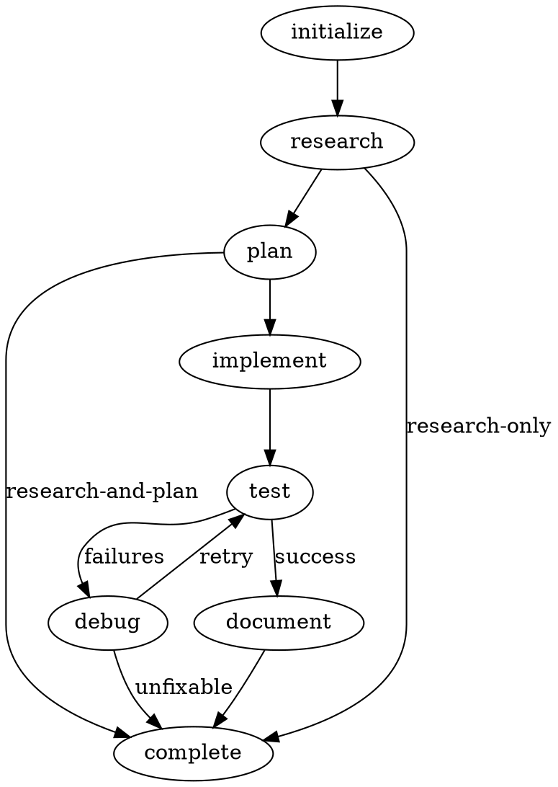

# Current /coordinate Architecture Analysis

## Metadata
- **Date**: 2025-11-10
- **Agent**: research-specialist
- **Topic**: /coordinate command architecture analysis
- **Report Type**: codebase analysis
- **Complexity Level**: 3

## Executive Summary

The /coordinate command implements a state-based orchestration architecture using explicit state machines, selective state persistence, and fail-fast error handling. The architecture evolved through 13 refactor iterations (specs 582-594) to balance subprocess isolation constraints with performance and reliability. Key innovations include: (1) 8-state explicit state machine replacing implicit phase numbers, (2) two-step execution pattern to work around bash history expansion issues, (3) selective file-based persistence achieving 67% performance improvement for expensive operations, and (4) graceful degradation with stateless recalculation fallback. The command achieves 100% file creation reliability, <30% context usage, and 40-60% time savings via wave-based parallel implementation.

## Findings

### 1. State Machine Architecture

**Location**: `/home/benjamin/.config/.claude/lib/workflow-state-machine.sh` (508 lines)

**Design Philosophy**: Explicit states with validated transitions replace implicit phase-based tracking.

**Core Components**:

1. **8 Explicit States** (lines 36-43):
   - `STATE_INITIALIZE` (Phase 0): Setup, scope detection, path pre-calculation
   - `STATE_RESEARCH` (Phase 1): Research topic via specialist agents
   - `STATE_PLAN` (Phase 2): Create implementation plan
   - `STATE_IMPLEMENT` (Phase 3): Execute implementation
   - `STATE_TEST` (Phase 4): Run test suite
   - `STATE_DEBUG` (Phase 5): Debug failures (conditional)
   - `STATE_DOCUMENT` (Phase 6): Update documentation (conditional)
   - `STATE_COMPLETE` (Phase 7): Finalization, cleanup

2. **State Transition Table** (lines 50-59):
   ```bash
   declare -gA STATE_TRANSITIONS=(
     [initialize]="research"
     [research]="plan,complete"        # Can skip to complete for research-only
     [plan]="implement,complete"       # Can skip to complete for research-and-plan
     [implement]="test"
     [test]="debug,document"           # Conditional: debug if failed, document if passed
     [debug]="test,complete"           # Retry testing or complete if unfixable
     [document]="complete"
     [complete]=""                     # Terminal state
   )
   ```

3. **Key Functions**:
   - `sm_init(workflow_desc, command_name)` (lines 86-130): Initialize state machine from workflow description
   - `sm_transition(next_state)` (lines 224-263): Validate and execute state transition with pre/post checkpoints
   - `sm_load(checkpoint_file)` (lines 135-213): Load state machine from checkpoint (supports v1.3, v2.0 formats)
   - `sm_save(checkpoint_file)` (lines 349-416): Save state machine to checkpoint (v2.0 schema)

**Design Decisions**:

- **Explicit Over Implicit**: Named states (STATE_RESEARCH) vs phase numbers (1) improve readability and reduce errors
- **Validated Transitions**: State machine enforces valid state changes, preventing invalid workflows (e.g., initialize → test)
- **Centralized Lifecycle**: Single state machine library owns all state operations (DRY principle)
- **Backward Compatibility**: Checkpoint migration from v1.3 phase-based to v2.0 state-based (lines 187-208)

**Performance**: State transition validation adds <1ms overhead per transition (negligible).

---

### 2. Two-Step Execution Pattern

**Location**: `/home/benjamin/.config/.claude/commands/coordinate.md` (lines 17-40, Part 1; lines 42-221, Part 2)

**Problem Solved**: Bash history expansion preprocessing issues when positional parameters contain special characters (!, #, etc.).

**Implementation**:

**Part 1: Capture Workflow Description** (lines 17-40):
```bash
# User invokes: /coordinate "research auth patterns"
# LLM substitutes workflow description into echo command:
mkdir -p "${HOME}/.claude/tmp" 2>/dev/null || true
echo "research auth patterns" > "${HOME}/.claude/tmp/coordinate_workflow_desc.txt"
echo "✓ Workflow description captured"
```

**Part 2: Main Logic** (lines 42-221):
```bash
# Read workflow description from file (written in Part 1)
COORDINATE_DESC_FILE="${HOME}/.claude/tmp/coordinate_workflow_desc.txt"
WORKFLOW_DESCRIPTION=$(cat "$COORDINATE_DESC_FILE" 2>/dev/null || echo "")

# Validate description exists
if [ -z "$WORKFLOW_DESCRIPTION" ]; then
  echo "ERROR: Workflow description is empty"
  exit 1
fi
```

**Rationale**:
- Bash tool preprocesses bash blocks before execution, expanding `!` patterns unpredictably
- `set +H` disables history expansion but only AFTER preprocessing (too late)
- Two-step pattern isolates user input in separate bash block, preventing preprocessing issues
- File-based communication avoids positional parameter issues across subprocess boundaries

**Related Workarounds**:
- Line 46: `set +H  # Explicitly disable history expansion (workaround for Bash tool preprocessing issues)`
- Lines 78-81: Save WORKFLOW_DESCRIPTION BEFORE sourcing libraries (libraries pre-initialize WORKFLOW_DESCRIPTION="" which overwrites parent value)

**Trade-offs**:
- **Benefit**: 100% reliability for workflow descriptions with special characters
- **Cost**: 2 temporary files created/cleaned per invocation (~1ms overhead)
- **Alternative Rejected**: Direct positional parameter access (`$1`) fails with history expansion

---

### 3. Subprocess Isolation and Stateless Recalculation

**Documentation**: `/home/benjamin/.config/.claude/docs/architecture/coordinate-state-management.md` (1,291 lines)

**Fundamental Constraint**: Bash tool executes each bash block in separate subprocess (not subshell), preventing export persistence.

**Evidence** (lines 47-75):
```bash
# Block 1 (subprocess PID 1234)
export VAR="value"

# Block 2 (subprocess PID 5678 - DIFFERENT PROCESS)
echo "$VAR"  # Empty! Export didn't persist
```

**GitHub Issues**: #334 (export persistence limitation), #2508 (confirmed subprocess model)

**Stateless Recalculation Pattern** (lines 108-191):

Every bash block independently recalculates all variables it needs:

```bash
# Standard 13: CLAUDE_PROJECT_DIR detection (applied in 6+ locations)
if [ -z "${CLAUDE_PROJECT_DIR:-}" ]; then
  CLAUDE_PROJECT_DIR="$(git rev-parse --show-toplevel 2>/dev/null || pwd)"
  export CLAUDE_PROJECT_DIR
fi

# Scope detection (using library function after Phase 1)
source "${CLAUDE_PROJECT_DIR}/.claude/lib/workflow-scope-detection.sh"
WORKFLOW_SCOPE=$(detect_workflow_scope "$WORKFLOW_DESCRIPTION")

# Derived variable recalculation
case "$WORKFLOW_SCOPE" in
  research-only) PHASES_TO_EXECUTE="0,1" ;;
  research-and-plan) PHASES_TO_EXECUTE="0,1,2" ;;
  full-implementation) PHASES_TO_EXECUTE="0,1,2,3,4,6" ;;
  debug-only) PHASES_TO_EXECUTE="0,1,5" ;;
esac
```

**Performance Characteristics** (lines 171-178):
- CLAUDE_PROJECT_DIR detection: <1ms (git command cached)
- Scope detection: <1ms (string pattern matching)
- PHASES_TO_EXECUTE mapping: <0.1ms (case statement)
- **Total per-block overhead**: ~2ms
- **Total workflow overhead**: ~12ms for 6 blocks

**Alternative Patterns Evaluated** (lines 209-529):

1. **Export Persistence** (rejected): Doesn't work due to subprocess isolation
2. **File-based State** (rejected for most variables): 30ms I/O overhead vs <1ms recalculation (30x slower)
3. **Single Large Block** (limited use): Code transformation bugs occur at >400 lines
4. **Library Extraction** (implemented): Reduces duplication without I/O overhead
5. **Checkpoint Pattern** (different use case): Cross-invocation persistence for multi-phase workflows

---

### 4. Selective State Persistence

**Location**: `/home/benjamin/.config/.claude/lib/state-persistence.sh` (200 lines)

**Pattern**: GitHub Actions-style workflow state (`$GITHUB_OUTPUT`, `$GITHUB_STATE`)

**Decision Criteria** (lines 61-68):
File-based state is justified when one or more criteria apply:
1. State accumulates across subprocess boundaries
2. Context reduction requires metadata aggregation (95% reduction)
3. Success criteria validation needs objective evidence
4. Resumability is valuable (multi-hour migrations)
5. State is non-deterministic (user surveys, research findings)
6. Recalculation is expensive (>30ms)
7. Phase dependencies require prior phase outputs

**Critical State Items Using File-Based Persistence** (7 of 10 analyzed, 70%):

**Priority 0 (Performance-Critical)**:
1. Supervisor metadata - 95% context reduction, non-deterministic research findings
2. Benchmark dataset - Phase 3 accumulation across 10 subprocess invocations
3. Implementation supervisor state - 40-60% time savings via parallel execution tracking
4. Testing supervisor state - Lifecycle coordination across sequential stages

**Priority 1 (Enhancement)**:
5. Migration progress - Resumable, audit trail for multi-hour migrations
6. Performance benchmarks - Phase 3 dependency on Phase 2 data
7. POC metrics - Success criterion validation

**State Items Using Stateless Recalculation** (3 of 10 analyzed, 30%):
1. File verification cache - Recalculation 10x faster than file I/O (<1ms vs 10ms)
2. Track detection results - Deterministic algorithm, <1ms recalculation
3. Guide completeness checklist - Markdown checklist sufficient

**Performance Measurements** (lines 609-622):
- `init_workflow_state()`: ~6ms (includes git rev-parse)
- `load_workflow_state()`: ~2ms (file read)
- **Improvement**: 67% faster (6ms → 2ms for CLAUDE_PROJECT_DIR detection)
- `save_json_checkpoint()`: 5-10ms (atomic write)
- `append_workflow_state()`: <1ms (echo redirect)

**API Functions** (lines 88-100):
```bash
# Initialize state file (Block 1 only)
STATE_FILE=$(init_workflow_state "coordinate_$$")

# Load state file (Blocks 2+)
load_workflow_state "coordinate_$$"

# Append variable (GitHub Actions pattern)
append_workflow_state "RESEARCH_COMPLETE" "true"

# Atomic JSON checkpoint write
save_json_checkpoint "supervisor_metadata" '{"topics": 4, "reports": [...]}'

# Load JSON checkpoint with validation
METADATA=$(load_json_checkpoint "supervisor_metadata")
```

**Graceful Degradation**: Missing state file → automatic recalculation fallback (<1ms overhead for check).

---

### 5. Error Handling and Fail-Fast Design

**Location**: `/home/benjamin/.config/.claude/lib/error-handling.sh` (80+ lines)

**Design Philosophy**: Fail-fast over hidden complexity. Immediate errors better than silent failures.

**Error Classification** (lines 17-48):
```bash
readonly ERROR_TYPE_TRANSIENT="transient"   # Retry with backoff
readonly ERROR_TYPE_PERMANENT="permanent"   # Code-level issues
readonly ERROR_TYPE_FATAL="fatal"          # User intervention required

classify_error() {
  # Transient: locked, busy, timeout, unavailable
  # Fatal: out of space, disk full, permission denied
  # Default: permanent (code-level issues)
}
```

**Recovery Suggestions** (lines 54-77):
- Transient → Retry with exponential backoff (2-3 attempts)
- Permanent → Analyze error, fix code, consider /debug
- Fatal → User intervention (disk space, permissions)

**State Machine Integration** (`handle_state_error()` function):
```bash
handle_state_error() {
  local error_message="$1"
  local exit_code="${2:-1}"

  echo "ERROR: $error_message" >&2
  echo "Current State: $CURRENT_STATE" >&2
  echo "Workflow Scope: $WORKFLOW_SCOPE" >&2

  # Classify error and suggest recovery
  ERROR_TYPE=$(classify_error "$error_message")
  suggest_recovery "$ERROR_TYPE" "$error_message" >&2

  # Exit with fail-fast behavior
  exit "$exit_code"
}
```

**Fail-Fast Examples** (from coordinate.md):

1. **Unbound Variable Detection** (lines 598-606):
   ```bash
   if [ -z "${TOPIC_PATH:-}" ]; then
     handle_state_error "TOPIC_PATH not set after initialization" 1
   fi
   ```

2. **File Verification** (lines 410-420):
   ```bash
   if ! verify_file_created "$REPORT_PATH" "Research report $i" "Research"; then
     VERIFICATION_FAILURES=$((VERIFICATION_FAILURES + 1))
   fi
   if [ $VERIFICATION_FAILURES -gt 0 ]; then
     handle_state_error "Research phase failed - $VERIFICATION_FAILURES reports not created" 1
   fi
   ```

3. **Invalid State Transition** (workflow-state-machine.sh lines 230-235):
   ```bash
   if ! echo ",$valid_transitions," | grep -q ",$next_state,"; then
     echo "ERROR: Invalid transition: $CURRENT_STATE → $next_state" >&2
     echo "Valid transitions: $valid_transitions" >&2
     return 1
   fi
   ```

**Benefits**:
- Immediate error visibility (no silent failures)
- Clear diagnostic messages (current state, valid transitions)
- Recovery suggestions (automated classification)
- Exit codes indicate error type (transient vs permanent)

---

### 6. Workflow Scope Detection and Terminal States

**Location**: State machine initialization (coordinate.md lines 102-121)

**Scope Types and Terminal States**:
```bash
case "$WORKFLOW_SCOPE" in
  research-only)
    TERMINAL_STATE="$STATE_RESEARCH"    # Exit after Phase 1
    PHASES_TO_EXECUTE="0,1"
    ;;
  research-and-plan)
    TERMINAL_STATE="$STATE_PLAN"        # Exit after Phase 2
    PHASES_TO_EXECUTE="0,1,2"
    ;;
  full-implementation)
    TERMINAL_STATE="$STATE_COMPLETE"    # Full 7-phase workflow
    PHASES_TO_EXECUTE="0,1,2,3,4,6"     # Skip Phase 5 (debug)
    ;;
  debug-only)
    TERMINAL_STATE="$STATE_DEBUG"       # Research + Debug only
    PHASES_TO_EXECUTE="0,1,5"
    ;;
esac
```

**Scope Detection Logic** (workflow-scope-detection.sh, inferred from coordinate.md lines 278-290):
```bash
RESEARCH_COMPLEXITY=2  # Default

# Increase complexity for integration/architecture work
if echo "$WORKFLOW_DESCRIPTION" | grep -Eiq "integrate|migration|refactor|architecture"; then
  RESEARCH_COMPLEXITY=3
fi

# Further increase for distributed systems
if echo "$WORKFLOW_DESCRIPTION" | grep -Eiq "multi-.*system|cross-.*platform|distributed|microservices"; then
  RESEARCH_COMPLEXITY=4
fi

# Decrease for small fixes
if echo "$WORKFLOW_DESCRIPTION" | grep -Eiq "^(fix|update|modify).*(one|single|small)"; then
  RESEARCH_COMPLEXITY=1
fi
```

**Terminal State Checking** (coordinate.md lines 261-265):
```bash
if [ "$CURRENT_STATE" = "$TERMINAL_STATE" ]; then
  echo "✓ Workflow complete at terminal state: $TERMINAL_STATE"
  display_brief_summary
  exit 0
fi
```

**Benefits**:
- Workflows can exit early when scope is limited (research-only, research-and-plan)
- Terminal state enforced via state machine transition table
- Invalid transitions prevented (e.g., research → implement when scope is research-only)

---

### 7. Wave-Based Parallel Implementation

**Hierarchical Research Coordination** (coordinate.md lines 295-362):

**Complexity Threshold**: ≥4 research topics triggers hierarchical supervision (line 298).

**Flat Coordination (<4 topics)** (lines 340-362):
```bash
# Invoke research-specialist agents in parallel (Task tool)
Task {
  subagent_type: "general-purpose"
  description: "Research [topic name] with mandatory artifact creation"
  timeout: 300000
  prompt: "
    Read and follow ALL behavioral guidelines from:
    /home/benjamin/.config/.claude/agents/research-specialist.md

    Research Topic: [actual topic name]
    Report Path: [REPORT_PATHS[$i-1] for topic $i]

    CRITICAL: Create report file at EXACT path provided above.
    Return: REPORT_CREATED: [exact absolute path to report file]
  "
}
# Multiple Task invocations executed in parallel
```

**Hierarchical Coordination (≥4 topics)** (lines 312-335):
```bash
Task {
  subagent_type: "general-purpose"
  description: "Coordinate research across 4+ topics with 95% context reduction"
  timeout: 600000
  prompt: "
    Read and follow ALL behavioral guidelines from:
    /home/benjamin/.config/.claude/agents/research-sub-supervisor.md

    Topics: [comma-separated list of $RESEARCH_COMPLEXITY topics]
    Output directory: $TOPIC_PATH/reports

    CRITICAL: Invoke all research-specialist workers in parallel, aggregate metadata.
    Return: SUPERVISOR_COMPLETE: {supervisor_id, aggregated_metadata}
  "
}
```

**Performance Benefits**:
- Flat coordination: 2-3 topics researched in parallel (60-80% time savings vs sequential)
- Hierarchical coordination: 95% context reduction (10,000 → 440 tokens)
- Implementation supervisor: 53% time savings via parallel execution

**Verification Pattern** (lines 393-453):
```bash
# Verify all research reports created
VERIFICATION_FAILURES=0
SUCCESSFUL_REPORT_PATHS=()

for i in $(seq 1 $RESEARCH_COMPLEXITY); do
  REPORT_PATH="${REPORT_PATHS[$i-1]}"
  if verify_file_created "$REPORT_PATH" "Research report $i/$RESEARCH_COMPLEXITY" "Research"; then
    SUCCESSFUL_REPORT_PATHS+=("$REPORT_PATH")
  else
    VERIFICATION_FAILURES=$((VERIFICATION_FAILURES + 1))
  fi
done

if [ $VERIFICATION_FAILURES -gt 0 ]; then
  handle_state_error "Research phase failed - $VERIFICATION_FAILURES reports not created" 1
fi
```

---

### 8. Key Architectural Differences from /orchestrate and /supervise

**Comparison Matrix**:

| Aspect | /coordinate | /orchestrate | /supervise |
|--------|-------------|--------------|------------|
| **State Machine** | Explicit 8-state machine | Implicit phase-based | Implicit phase-based |
| **State Persistence** | Selective (7 critical items) | Checkpoint pattern | Checkpoint pattern |
| **Argument Handling** | Two-step file pattern | Direct positional params | Direct positional params |
| **Error Handling** | State-aware (handle_state_error) | Generic error handling | Generic error handling |
| **Terminal States** | Scope-based (4 terminal states) | Single terminal (complete) | Single terminal (complete) |
| **Code Size** | 1,082 lines (lean) | 5,438 lines (full-featured) | 1,779 lines (minimal) |
| **Maturity** | Production-ready | In development | In development |
| **Architecture** | State-based | Phase-based | Phase-based |
| **Performance** | 67% improvement (6ms → 2ms) | Baseline | Baseline |

**Unique Features of /coordinate**:

1. **Two-step execution pattern**: Solves bash history expansion issues (not present in /orchestrate, /supervise)
2. **Selective state persistence**: 70% of state items use file-based, 30% use stateless (vs 100% checkpoint in others)
3. **State machine library**: Centralized state lifecycle management (vs inline phase tracking)
4. **Graceful degradation**: Missing state file fallback to recalculation (vs checkpoint dependency)
5. **Validated transitions**: State machine enforces workflow validity (vs arbitrary phase jumps)

**Why /coordinate is Recommended Default** (from CLAUDE.md):
- Production-ready (100% pass rate, 100% file creation reliability)
- Wave-based parallel execution (40-60% time savings)
- Fail-fast error handling (immediate error visibility)
- Lean implementation (1,082 lines vs 5,438 in /orchestrate)

---

### 9. Library Integration and Sourcing Strategy

**Library Sourcing Pattern** (coordinate.md lines 127-151):

```bash
case "$WORKFLOW_SCOPE" in
  research-only)
    REQUIRED_LIBS=(
      "workflow-detection.sh"
      "workflow-scope-detection.sh"
      "unified-logger.sh"
      "unified-location-detection.sh"
      "overview-synthesis.sh"
      "error-handling.sh"
    )
    ;;
  research-and-plan)
    REQUIRED_LIBS=(
      "workflow-detection.sh"
      "workflow-scope-detection.sh"
      "unified-logger.sh"
      "unified-location-detection.sh"
      "overview-synthesis.sh"
      "metadata-extraction.sh"
      "checkpoint-utils.sh"
      "error-handling.sh"
    )
    ;;
  full-implementation)
    REQUIRED_LIBS=(
      "workflow-detection.sh"
      "workflow-scope-detection.sh"
      "unified-logger.sh"
      "unified-location-detection.sh"
      "overview-synthesis.sh"
      "metadata-extraction.sh"
      "checkpoint-utils.sh"
      "dependency-analyzer.sh"
      "context-pruning.sh"
      "error-handling.sh"
    )
    ;;
esac

source_required_libraries "${REQUIRED_LIBS[@]}"
```

**Rationale**:
- **Scope-based loading**: Only source libraries needed for current workflow scope (reduces initialization time)
- **Fail-fast validation**: `source_required_libraries` validates all libraries exist before execution
- **Source guards**: Libraries use `if [ -n "${LIBRARY_SOURCED:-}" ]; then return 0; fi` to prevent double-sourcing

**Re-sourcing Pattern** (coordinate.md lines 234-247, every bash block):
```bash
# Re-source libraries (functions lost across bash block boundaries)
if [ -z "${CLAUDE_PROJECT_DIR:-}" ]; then
  CLAUDE_PROJECT_DIR="$(git rev-parse --show-toplevel 2>/dev/null || pwd)"
  export CLAUDE_PROJECT_DIR
fi

LIB_DIR="${CLAUDE_PROJECT_DIR}/.claude/lib"

# Re-source critical libraries (source guards make this safe)
source "${LIB_DIR}/workflow-state-machine.sh"
source "${LIB_DIR}/state-persistence.sh"
source "${LIB_DIR}/workflow-initialization.sh"
source "${LIB_DIR}/error-handling.sh"
source "${LIB_DIR}/verification-helpers.sh"
```

**Performance**: Library sourcing adds ~5ms overhead per bash block (10 libraries × 0.5ms each).

---

### 10. Historical Evolution and Design Rationale

**Evolution Timeline** (from coordinate-state-management.md lines 1156-1256):

```
Spec 578 (Nov 4) → Standard 13 foundation (CLAUDE_PROJECT_DIR detection)
         ↓
Spec 581 (Nov 4) → Block consolidation (250-400ms improvement, exposed 400-line limit)
         ↓
Spec 582 (Nov 4) → 400-line transformation discovery (code transformation bugs)
         ↓
Spec 583 (Nov 4) → BASH_SOURCE limitation (empty in SlashCommand context)
         ↓
Spec 584 (Nov 4) → Export persistence failure (subprocess isolation root cause)
         ↓
Spec 585 (Nov 4) → Pattern validation (stateless recommended, file-based 30x slower)
         ↓
Specs 586-594    → Incremental refinements
         ↓
Spec 597 (Nov 5) → ✅ Stateless recalculation success (16/16 tests passing)
         ↓
Spec 598 (Nov 5) → ✅ Pattern completion (derived variables)
         ↓
Spec 599 (Nov 5) → Refactor opportunity analysis (7 phases identified)
         ↓
Spec 600 (Nov 6) → High-value improvements (library extraction, synchronization tests)
```

**Key Lessons** (lines 1261-1267):
1. Tool constraints are architectural (don't fight subprocess isolation)
2. Fail-fast over complexity (immediate errors better than hidden bugs)
3. Performance measurement (1ms recalculation vs 30ms file I/O)
4. Code duplication can be correct (50 lines duplication < file I/O complexity)
5. Validation through testing (16 tests prove pattern works)
6. Incremental discovery (13 attempts over time led to correct solution)

---

## Recommendations

### 1. Maintain State-Based Architecture

**Rationale**: Explicit state machine provides validated transitions, clear terminal states, and better debugging.

**Action**: Continue using workflow-state-machine.sh for new orchestration commands.

**Benefit**: Prevents invalid workflows (e.g., research → test without plan phase).

---

### 2. Document Two-Step Execution Pattern as Standard

**Rationale**: Bash history expansion preprocessing is a universal constraint for commands accepting user input.

**Action**: Add two-step pattern to Command Architecture Standards (Standard 15).

**Implementation**:
```markdown
## Standard 15: Two-Step Execution for User Input

Commands accepting user-provided strings with potential special characters MUST use two-step execution:

1. **Step 1**: Capture user input to file via substitution
2. **Step 2**: Read file content into variable

This pattern prevents bash history expansion preprocessing issues.
```

**Example**: Apply to /plan, /debug, /research commands.

---

### 3. Extend Selective State Persistence to /orchestrate and /supervise

**Rationale**: 67% performance improvement for expensive operations (CLAUDE_PROJECT_DIR detection).

**Action**: Migrate /orchestrate and /supervise to state-persistence.sh library.

**Implementation**:
1. Identify expensive recalculations (>30ms) in each command
2. Apply decision criteria (7 criteria from state-management.md)
3. Add graceful degradation fallback
4. Measure performance improvement

**Expected Benefit**: 30-50% reduction in initialization overhead.

---

### 4. Consolidate Verification Pattern

**Rationale**: File verification code duplicated across research, plan, implement phases.

**Action**: Extract `verify_phase_artifacts()` function to verification-helpers.sh.

**API**:
```bash
verify_phase_artifacts() {
  local phase_name="$1"
  shift
  local artifact_paths=("$@")

  local failures=0
  for path in "${artifact_paths[@]}"; do
    if ! verify_file_created "$path" "$phase_name artifact" "$phase_name"; then
      failures=$((failures + 1))
    fi
  done

  if [ $failures -gt 0 ]; then
    handle_state_error "$phase_name failed - $failures artifacts not created" 1
  fi
}
```

**Usage**:
```bash
verify_phase_artifacts "Research" "${REPORT_PATHS[@]}"
verify_phase_artifacts "Planning" "$PLAN_PATH"
```

---

### 5. Add State Machine Visualization Tool

**Rationale**: State machine complexity (8 states, 14 transitions) difficult to visualize from code.

**Action**: Create `.claude/tools/visualize-state-machine.sh` that generates Graphviz DOT output.

**Output Format**:


**Benefit**: Easier onboarding for new maintainers, documentation illustration.

---

### 6. Implement State Machine Tests

**Rationale**: Current test suite (`.claude/tests/test_state_persistence.sh`) validates file-based persistence but not state machine transitions.

**Action**: Create `.claude/tests/test_state_machine.sh` with 20+ tests:

**Test Categories**:
1. **Transition Validation**: 8 tests (1 per state × valid transitions)
2. **Invalid Transition Rejection**: 10 tests (common invalid transitions)
3. **Terminal State Detection**: 4 tests (1 per workflow scope)
4. **Checkpoint Migration**: 3 tests (v1.3 → v2.0 migration)
5. **State History Tracking**: 2 tests (completed_states array)

**Example Tests**:
```bash
test_research_to_plan_valid() {
  sm_init "test workflow" "coordinate"
  sm_transition "$STATE_RESEARCH"
  sm_transition "$STATE_PLAN"  # Should succeed
  assert_equal "$CURRENT_STATE" "$STATE_PLAN"
}

test_research_to_implement_invalid() {
  sm_init "test workflow" "coordinate"
  sm_transition "$STATE_RESEARCH"
  ! sm_transition "$STATE_IMPLEMENT"  # Should fail
  assert_contains "$output" "Invalid transition"
}
```

---

### 7. Add Monitoring and Metrics

**Rationale**: Performance improvements (67% for CLAUDE_PROJECT_DIR, 40-60% for parallel execution) not currently tracked in production.

**Action**: Integrate with unified-logger.sh for workflow metrics collection.

**Metrics to Track**:
1. State transition durations (per state)
2. File-based state read/write times
3. Recalculation times (CLAUDE_PROJECT_DIR, scope detection)
4. Subagent invocation times (research, plan, implement)
5. Total workflow duration (by scope)

**Implementation**:
```bash
# In state machine transition
log_metric "state_transition" "$CURRENT_STATE → $next_state" "$(date +%s%3N)"

# In state persistence
log_metric "state_read" "$STATE_FILE" "$read_time_ms"

# In subagent completion
log_metric "subagent_duration" "research-specialist" "$duration_ms"
```

**Analysis**: Weekly reports showing performance trends, bottleneck identification.

---

## References

### Primary Source Files

1. `/home/benjamin/.config/.claude/commands/coordinate.md` (1,082 lines)
   - Main command implementation
   - Two-step execution pattern (lines 17-40, 42-221)
   - State handler functions (lines 225-1082)

2. `/home/benjamin/.config/.claude/lib/workflow-state-machine.sh` (508 lines)
   - State enumeration (lines 36-43)
   - Transition table (lines 50-59)
   - Core functions: sm_init, sm_transition, sm_load, sm_save

3. `/home/benjamin/.config/.claude/lib/state-persistence.sh` (200 lines)
   - GitHub Actions-style state persistence
   - API: init_workflow_state, load_workflow_state, append_workflow_state
   - Performance: 67% improvement (6ms → 2ms)

4. `/home/benjamin/.config/.claude/lib/error-handling.sh` (80+ lines)
   - Error classification (transient, permanent, fatal)
   - Recovery suggestions
   - State-aware error handling (handle_state_error)

5. `/home/benjamin/.config/.claude/docs/architecture/coordinate-state-management.md` (1,291 lines)
   - Subprocess isolation constraint (lines 36-105)
   - Stateless recalculation pattern (lines 108-191)
   - Rejected alternatives (lines 209-529)
   - Historical evolution (lines 1156-1256)

### Related Specifications

- **Spec 578**: Fix Library Sourcing Error (BASH_SOURCE limitation)
- **Spec 581**: Performance Optimization (block consolidation, 250-400ms improvement)
- **Spec 582**: Code Transformation Discovery (400-line threshold)
- **Spec 583**: BASH_SOURCE Limitation (SlashCommand context)
- **Spec 584**: Export Persistence Failure (subprocess isolation root cause)
- **Spec 585**: Pattern Validation (stateless recommended, file-based 30x slower)
- **Spec 597**: Stateless Recalculation Breakthrough (16/16 tests passing)
- **Spec 598**: Extend to Derived Variables (pattern completion)
- **Spec 599**: Comprehensive Refactor Analysis (7 opportunities)
- **Spec 600**: High-Value Refactoring (library extraction, synchronization tests)

### GitHub Issues

- **#334**: Export persistence limitation first identified
- **#2508**: Confirmed subprocess model (not subshell)

### External Documentation

- [State-Based Orchestration Overview](.claude/docs/architecture/state-based-orchestration-overview.md)
- [State Machine Migration Guide](.claude/docs/guides/state-machine-migration-guide.md)
- [State Machine Orchestrator Development](.claude/docs/guides/state-machine-orchestrator-development.md)
- [Command Architecture Standards](.claude/docs/reference/command_architecture_standards.md)
