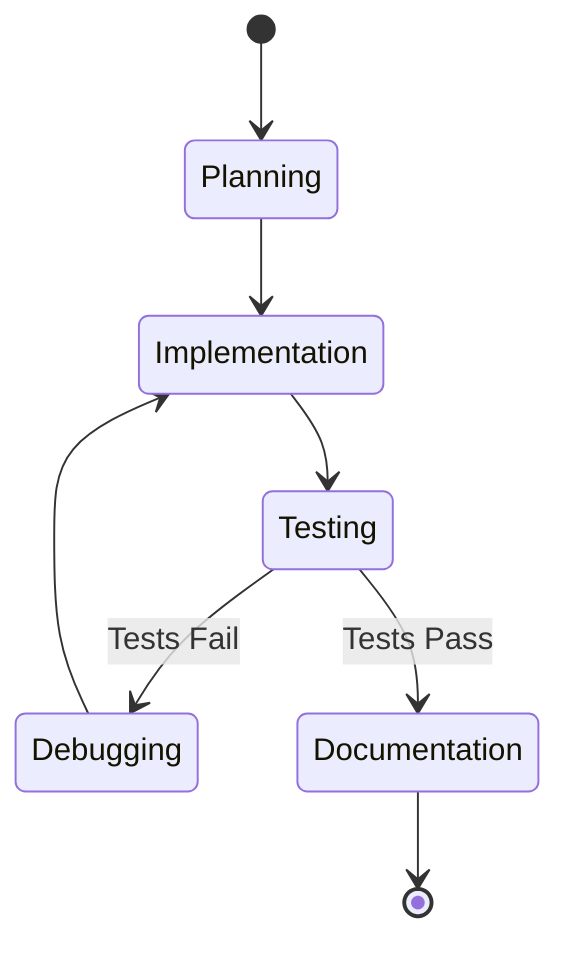

# State-of-the-Art Documentation Standards Research Report

## Metadata
- **Date**: 2025-11-16
- **Agent**: research-specialist
- **Topic**: State-of-the-Art Documentation Standards
- **Report Type**: best practices
- **Complexity Level**: 4

## Executive Summary

State-of-the-art documentation systems in 2025 emphasize documentation-as-code with structured frameworks (Diataxis), architectural decision records (ADRs), and continuous maintenance workflows. Leading practices include automated versioning (semantic versioning with changelogs), quality metrics (readability scores, support deflection rates), and organization patterns proven by exemplar projects like Stripe and Twilio. The current project demonstrates strong alignment with industry best practices through Diataxis adoption, comprehensive cross-referencing, and topic-based artifact organization.

## Findings

### 1. Documentation Frameworks and Organization

#### Diataxis Framework (Industry Standard)

The Diataxis framework represents the current gold standard for technical documentation organization, adopted by major projects including Gatsby, Cloudflare, Ubuntu/Canonical, and Python:

**Four-Quadrant System**:
- **Tutorials** (learning-oriented): Step-by-step lessons for skill acquisition
- **How-To Guides** (task-oriented): Goal-focused practical instructions
- **Reference** (information-oriented): Dry, factual lookup materials
- **Explanation** (understanding-oriented): Conceptual architecture and design

**Key Benefits**:
- Light-weight and pragmatic approach to meeting users' needs systematically
- Provides standards and methodology to guide documentation work
- Brings an active principle of quality that helps maintainers think effectively
- Easy to grasp and straightforward to apply without imposing implementation constraints

**Source**: https://diataxis.fr/

**Current Project Analysis**:
The project's `.claude/docs/` directory (lines 1-771 of /home/benjamin/.config/.claude/docs/README.md) demonstrates excellent Diataxis implementation:
- `/reference/` - Information-oriented quick lookup (14 files)
- `/guides/` - Task-focused how-to guides (19 files)
- `/concepts/` - Understanding-oriented explanations (5 files + patterns catalog)
- `/workflows/` - Learning-oriented tutorials (7 files)

This structure shows mature adoption of industry best practices.

#### Architecture Decision Records (ADRs)

ADRs have become a standard practice for documenting architectural decisions in software projects, recommended by AWS, Microsoft Azure, and Google Cloud.

**Standard Structure**:
- **Title/Number**: Short noun phrase (e.g., "ADR 1: Deployment on Ruby on Rails 3.0.10")
- **Context**: Forces at play (technological, political, social, project local)
- **Decision**: Response to forces in full sentences with active voice
- **Status**: proposed | accepted | deprecated | superseded
- **Consequences**: Resulting context (positive, negative, neutral)

**Best Practices**:
- Keep each ADR to one or two pages
- Write as a conversation with future developers
- Store in Markdown files close to relevant codebase
- Maintain as append-only log
- Use value-neutral language for context, active voice for decisions

**Source**: Michael Nygard's 2011 blog post "Documenting Architecture Decisions", now standard practice at major technology organizations

**Current Project Gap**: No systematic ADR implementation detected in the codebase.

### 2. Documentation-as-Code Movement

The docs-as-code philosophy has become the industry standard in 2025, treating documentation with the same tools and workflows as code.

#### Core Principles

- Write documentation with the same tools as code
- Follow same workflows as development teams
- Integrate documentation in product team processes
- Use version control for all documentation
- Integrate documentation updates in pull requests
- Use CI/CD pipelines to build and deploy documentation automatically

#### Popular Tools and Technologies (2025)

**Static Site Generators**:
- **Docusaurus** - React-based from Meta, go-to choice for open-source projects with Markdown/MDX support, versioning, localization
- **MkDocs** - Python-powered, fast and simple with Material theme
- **Sphinx** - Python community standard, supports reStructuredText and Markdown

**Markup Languages**:
- **Markdown** - Popular for simplicity and ease of use
- **AsciiDoc** - Feature-rich for complex documentation
- **reStructuredText** - Used with Sphinx, powerful for technical docs

**Code Documentation Generators**:
- **Doxygen** - Multi-language support (C++, C, Java, Python), generates HTML/LaTeX/RTF/PDF
- **Sphinx** - Wide adoption in Python community

**Benefits Measured**:
- 30-45% faster onboarding for new team members (2025 studies)
- 63% faster onboarding with high-quality documentation (2025 Developer Experience Report)

**Current Project Analysis**: Strong docs-as-code implementation evident in `/home/benjamin/.config/.claude/docs/` structure with Markdown files, clear organization, and integration with development workflows.

### 3. Documentation Quality Metrics and Measurement

#### Key Performance Indicators (2025)

Modern documentation systems implement measurable quality metrics:

**Quality-Focused Metrics**:
- **Error Rate**: Accuracy of documentation content
- **User Feedback Scores**: Satisfaction and effectiveness ratings
- **Adherence to Style Guides**: Consistency measurement
- **Readability**: Flesch Reading Ease Formula (70-80 score = grade 8 level, optimal for adult comprehension)

**Usage Metrics**:
- **Page Hits**: Frequency of documentation access
- **Distinct Visitors**: Unique user tracking
- **Average Time on Page**: Engagement measurement
- **Most Accessed Pages**: Popular content identification

**Impact Metrics**:
- **Support Ticket Deflection Rate**: Users finding answers without submitting tickets
- **Self-Service Success Rate**: Problems solved through documentation alone
- **Onboarding Time Reduction**: New developer productivity gains

**Measurement Approach**: Track progress over time while maintaining quality, recognizing that technical writing KPIs are traditionally elusive but critical for continuous improvement.

**Current Project Gap**: No systematic quality metrics implementation detected.

### 4. Versioning and Changelog Standards

#### Semantic Versioning (SemVer) 2.0.0

Industry standard for version numbering using X.Y.Z (Major.Minor.Patch) format:
- **Patch**: Bug fixes (backward compatible)
- **Minor**: New features/changes (backward compatible)
- **Major**: Breaking changes (backward incompatible)

**Documentation Requirements**:
- Declare public API clearly in documentation or code
- API must be clear and precise
- Communicate risk through version numbers
- Provide release notes describing what changed and why

**Source**: https://semver.org/

#### Keep a Changelog Format

Recommended changelog structure for 2025:
- CHANGELOG.md file at project root
- Clear documentation of all changes
- Stakeholder notification through various channels
- Migration guides for breaking changes

**Automation Tools**:
- **Semantic Release**: Automates version bumps and changelog generation
- **Conventional Commits**: Automates versioning through commit message analysis
- Various plugins for tracking changes and generating changelogs

**Current Project Analysis**: Project uses git history for tracking but lacks formal CHANGELOG.md or semantic versioning for documentation artifacts.

### 5. Documentation Best Practices (2025)

#### Core Practices

**Style Guides and Consistency**:
- Establish thorough style guide (foundation of clarity)
- Adapt from Google or Microsoft documentation style guides
- Standardize layout and structure across all documentation
- Promote consistent and professional appearance

**Regular Updates and Maintenance**:
- Align documentation with latest functionality
- Set regular review cycles for accuracy and relevance
- Treat documentation as living document
- Integrate updates in daily workflow (especially for agile environments)

**Audience-Focused Approach**:
- Tailor to audience's technical understanding level
- End-users: Simplified explanations and step-by-step instructions
- Developers: Technical specs and code samples
- Ensure relevance and accessibility for target audience

**Visual Elements**:
- Use flowcharts, diagrams, and screenshots
- Well-positioned graphics communicate complex ideas effectively
- Supplement written explanations with visual aids

**Modern Features (2025)**:
- Interactive guides
- Embedded videos
- Searchable knowledge bases
- AI-assisted help systems that adapt to user needs

**Accessibility**:
- Essential requirement in 2025, not just good practice
- Ensure documentation accessible to all users

**Common Standards**:
- Business Process Model and Notation (BPMN)
- Unified Modeling Language (UML)
- Use familiar notations for broader accessibility

**Current Project Strengths**:
- Visual diagrams using Unicode box-drawing (line 160, /home/benjamin/.config/CLAUDE.md)
- Clear audience segmentation (lines 406-428, /home/benjamin/.config/.claude/docs/README.md)
- No emojis policy for UTF-8 compatibility (line 161, /home/benjamin/.config/CLAUDE.md)
- CommonMark specification adherence (line 162, /home/benjamin/.config/CLAUDE.md)

### 6. Knowledge Management in Mature Projects

#### Organizational Best Practices

**Version Control and Auditing**:
- Robust version control ensures working on latest version
- Ability to see previous drafts and iterations
- Rollback capability to older versions
- Regular knowledge audits for comprehensiveness and relevance
- Check for gaps and obsolete data
- Improve structure for easier navigation

**Knowledge Organization**:
- Build clear inventory of knowledge sources as metadata
- Track documents, Wiki pages, development tools (JIRA), source-code libraries, application logs, support systems
- Establish robust knowledge transition process
- Ensure teams have access to historical knowledge

**Popular Tools**:
- **Confluence**: Development teams for software documentation and workflow coordination
- **Jira**: Agile project management with scrum boards, backlog grooming, version management
- **Code Reverse-Engineering Tools**: Generate documentation from code

**Risk Mitigation**:
- Building software with incomplete documentation makes current team the only knowledge owner
- If team members leave, knowledge is lost
- Knowledge management provides future-proof strategy

**Current Project Analysis**: Strong knowledge organization evident in topic-based structure (`specs/{NNN_topic}/`) with cross-referenced artifacts and clear ownership (lines 254-275, /home/benjamin/.config/.claude/docs/README.md).

### 7. Exemplar Documentation Organizations

#### Stripe Documentation Best Practices

Industry gold standard characteristics:

**Organization Approach**:
- Organized around real developer goals, not just endpoint/method lists
- Left-hand menu stays anchored during navigation
- Expands to reveal deeper subtopics on click
- Categories on both menu and main content completely laid out

**Quality Standards**:
- Consistency and reliability of API documentation
- Clear guidelines for error handling
- Sandbox environment testing instructions
- Scaling implementation guidance
- Detailed API reference documentation for robust integrations

**Source**: https://devdocs.work/post/stripe-twilio-achieving-growth-through-cutting-edge-documentation

#### Twilio Documentation Best Practices

Comprehensive, easy-to-navigate documentation for developers:

**Structure**:
- Guides structured around common use cases ("Send messages", "Record a call", "Verify WhatsApp number")
- Interactive components (code snippets executable in browser)
- Enables direct API testing and immediate result viewing
- Organized to avoid overwhelming users while maintaining depth

**Integration**:
- Integrated with community forums and support resources
- Developers can seek help, share knowledge, get feedback
- Both Twilio staff and community developer support
- Full company commitment behind documentation (not siloed to one team)

**Philosophy**:
- Prioritize customer needs: understand platform first, successfully onboard second
- Regular updates reflecting new features and best practices
- Current information always accessible

**Current Project Alignment**: Project demonstrates similar philosophy with "I Want To..." section (lines 16-81, /home/benjamin/.config/.claude/docs/README.md) organizing content by user goals rather than technical structure.

#### README Driven Development (RDD)

Documentation-first approach gaining adoption:

**Core Principle**:
- Write README before any code, tests, behaviors, or stories
- Think through project without code change overhead
- Design documentation in single introductory file

**Benefits**:
- **Better Design Decisions**: Think through project before implementation commitment
- **Easier Pivoting**: Pivot without wasted development time
- **Improved Communication**: Better team and stakeholder understanding
- **Documentation Availability**: Nice documentation as byproduct of implementation planning

**Distinction from Documentation Driven Development**:
- RDD is subset/limited version of DDD
- Single file restriction prevents DDD-turned-waterfall syndrome
- Punishes lengthy or overprecise specification

**Source**: Tom Preston-Werner's "Readme Driven Development" (2010), now widely adopted in open-source communities

**Current Project Alignment**: Strong README culture evident with comprehensive README.md files in every directory providing purpose, navigation, and usage examples.

### 8. Current Project Documentation Analysis

#### Strengths

**Diataxis Framework Implementation**:
- Complete four-quadrant organization (reference, guides, concepts, workflows)
- Clear category separation with 47+ documented files
- "I Want To..." task-oriented index (lines 16-81, /home/benjamin/.config/.claude/docs/README.md)
- Role-based quick start guides (lines 406-428)

**Navigation and Discoverability**:
- Multiple navigation paths (by category, topic, role)
- Cross-referencing between related documents
- Hierarchical organization with clear parent-child relationships
- Quick reference decision trees and flowcharts

**Content Quality**:
- Clear writing standards documented (lines 507-518, /home/benjamin/.config/.claude/docs/README.md)
- No emojis policy for encoding compatibility
- Unicode box-drawing for diagrams
- CommonMark specification adherence
- Code examples with syntax highlighting

**Integration with Development**:
- Neovim picker integration for easy access (lines 429-499)
- Documentation as first-class workflow component
- Topic-based artifact organization
- Comprehensive cross-referencing system

**Metadata and Structure**:
- Content ownership clearly defined (lines 101-109)
- Single source of truth for each domain
- Prevention of content duplication through cross-references
- Consistent file naming (kebab-case)

#### Areas for Enhancement

**Missing Industry Patterns**:
1. **Architecture Decision Records (ADRs)**: No systematic ADR implementation
2. **Quality Metrics**: No measurable KPIs for documentation effectiveness
3. **Changelog/Versioning**: No formal CHANGELOG.md or semantic versioning for docs
4. **Interactive Components**: No executable code examples or API testing playground

**Potential Improvements**:
1. Implement ADR system for architectural decisions
2. Add documentation quality metrics dashboard
3. Create CHANGELOG.md for tracking documentation evolution
4. Consider interactive elements for complex workflows
5. Add readability scores and user feedback mechanisms

## Recommendations

### 1. Implement Architecture Decision Records (ADRs)

**Priority**: High
**Effort**: Medium

Create `.claude/docs/decisions/` directory following ADR standards:

```
.claude/docs/decisions/
├── README.md                    # ADR index and template
├── 001-diataxis-adoption.md     # Document existing architectural decisions
├── 002-behavioral-injection.md
├── 003-topic-based-organization.md
└── template.md                  # Standard ADR template
```

**Template Structure**:
```markdown
# ADR {NUMBER}: {TITLE}

**Status**: proposed | accepted | deprecated | superseded
**Date**: YYYY-MM-DD
**Decision Makers**: {roles or individuals}

## Context

{Forces at play, described in value-neutral language}

## Decision

{The response to these forces, in full sentences with active voice}

## Consequences

### Positive
- {Beneficial outcomes}

### Negative
- {Costs or drawbacks}

### Neutral
- {Other impacts}

## References
- {Related documents, code, or external sources}
```

**Benefits**:
- Capture rationale for major architectural choices
- Provide historical context for future maintainers
- Support onboarding and knowledge transfer
- Enable evidence-based architectural discussions

**Implementation Approach**:
1. Create decisions directory and template
2. Document 5-10 key existing architectural decisions (Diataxis, behavioral injection, topic-based structure)
3. Integrate ADR creation into development workflow
4. Add ADR references to relevant documentation

### 2. Add Documentation Quality Metrics

**Priority**: Medium
**Effort**: Medium-High

Implement measurable quality indicators:

**Metrics to Track**:
1. **Readability Scores**: Run Flesch Reading Ease on all documentation (target: 70-80)
2. **Completeness**: Percentage of modules with README files
3. **Freshness**: Last update dates, identify stale documentation
4. **Link Health**: Broken link detection and reporting
5. **Usage Analytics**: If documentation served via web, track page views and time-on-page

**Implementation**:
- Create `.claude/scripts/doc-metrics.sh` for automated measurement
- Add to CI/CD pipeline or pre-commit hooks
- Generate monthly quality reports
- Set quality thresholds and alerts

**Example Script Structure**:
```bash
#!/usr/bin/env bash
# Calculate documentation quality metrics

# Readability scores (requires textstat or similar)
calculate_readability() {
  find .claude/docs -name "*.md" -exec flesch-ease {} \;
}

# Completeness check
check_completeness() {
  # Count directories without README.md
  find .claude -type d ! -path "*/.git/*" -exec test -e {}/README.md \; -print
}

# Link health
check_links() {
  # Use markdown-link-check or similar tool
  find .claude/docs -name "*.md" -exec markdown-link-check {} \;
}

# Generate report
generate_report() {
  echo "Documentation Quality Report - $(date)"
  echo "=================================="
  calculate_readability | summarize
  check_completeness | count
  check_links | summarize
}
```

**Benefits**:
- Objective quality measurement
- Identify documentation debt
- Track improvement over time
- Maintain high standards automatically

### 3. Create Documentation Changelog

**Priority**: Medium
**Effort**: Low

Add `.claude/docs/CHANGELOG.md` following Keep a Changelog format:

```markdown
# Documentation Changelog

All notable changes to the documentation will be documented in this file.

The format is based on [Keep a Changelog](https://keepachangelog.com/en/1.0.0/),
and this project adheres to [Semantic Versioning](https://semver.org/spec/v2.0.0.html).

## [Unreleased]

### Added
- Architecture Decision Records (ADRs) system

### Changed
- Updated agent development guide with new patterns

### Deprecated
- Legacy orchestration patterns (see archive/)

### Removed
- Obsolete command examples

### Fixed
- Broken links in hierarchical agents guide

## [2.1.0] - 2025-11-16

### Added
- State-based orchestration architecture documentation
- Performance metrics for parallel execution

### Changed
- Migrated from task-based to state-machine orchestration
```

**Benefits**:
- Track documentation evolution
- Communicate changes to users
- Identify breaking changes in documentation structure
- Support versioned documentation releases

**Maintenance**:
- Update CHANGELOG.md with each significant documentation change
- Include changelog updates in documentation PRs
- Review quarterly for completeness

### 4. Enhance Interactive Documentation

**Priority**: Low
**Effort**: High

Consider adding interactive elements for complex workflows:

**Potential Additions**:
1. **Mermaid Diagrams**: Replace some Unicode diagrams with Mermaid for better visualization
2. **Code Playground**: For command syntax exploration
3. **Decision Trees**: Interactive flowcharts for command selection
4. **Embedded Examples**: Runnable code snippets with expected output

**Example - Mermaid Integration**:
```markdown
## Workflow State Machine


```

**Benefits**:
- Better visualization of complex systems
- Hands-on learning for users
- Reduced cognitive load for understanding workflows
- More engaging documentation experience

**Considerations**:
- Requires rendering support (GitHub, MkDocs, etc.)
- May add complexity to maintenance
- Ensure fallback for text-only viewers

### 5. Implement Documentation Review Process

**Priority**: Medium
**Effort**: Low-Medium

Establish systematic documentation review:

**Review Checklist** (add to `.claude/docs/CONTRIBUTING.md`):
```markdown
## Documentation Review Checklist

Before merging documentation changes:

### Content Quality
- [ ] Clear purpose statement in first paragraph
- [ ] Appropriate Diataxis category (reference/guide/concept/workflow)
- [ ] Code examples tested and working
- [ ] No temporal markers ("new", "recently", "soon")
- [ ] No emojis in content

### Structure
- [ ] Follows established template for category
- [ ] Includes navigation section with parent/child links
- [ ] Added to appropriate README index
- [ ] Cross-references updated in related documents

### Technical
- [ ] All links tested and working
- [ ] Markdown lints without errors
- [ ] Readability score 70-80 (if applicable)
- [ ] Code blocks have language identifiers

### Metadata
- [ ] Filename uses kebab-case
- [ ] Added to relevant quick reference sections
- [ ] Updated CHANGELOG.md (if significant change)
```

**Review Cadence**:
- **Pull Request Review**: Checklist completion required
- **Quarterly Audit**: Review all documentation for staleness
- **Annual Restructure**: Evaluate organization effectiveness

**Benefits**:
- Maintain consistent quality
- Prevent documentation debt
- Ensure compliance with standards
- Facilitate knowledge transfer

### 6. Add Search Optimization

**Priority**: Low
**Effort**: Medium

Enhance documentation discoverability:

**Strategies**:
1. **Keyword Metadata**: Add frontmatter with keywords/tags to each document
2. **Synonym Mapping**: Create search synonym file for common terms
3. **Search Index**: Generate searchable index of all documentation
4. **FAQ Section**: Consolidate common questions with cross-references

**Example Frontmatter**:
```markdown
---
title: "Behavioral Injection Pattern"
category: concepts/patterns
keywords: [agent, delegation, context, behavioral-file, reference]
related: [hierarchical-agents, agent-development-guide, forward-message]
---
```

**Implementation**:
- Add metadata to existing documentation
- Create `.claude/docs/search-index.json` for quick lookup
- Build simple search script for CLI usage
- Consider integration with Neovim picker for metadata-aware search

**Benefits**:
- Faster documentation discovery
- Better cross-referencing
- Improved user experience
- Support for multiple search strategies (keyword, concept, task)

### 7. Consolidate Style Guide

**Priority**: High
**Effort**: Low

Create comprehensive `.claude/docs/STYLE_GUIDE.md`:

**Sections to Include**:
1. **Writing Style**: Tone, voice, grammar rules
2. **Formatting Standards**: Headers, lists, code blocks, tables
3. **Terminology**: Preferred terms, capitalization, abbreviations
4. **Visual Elements**: Diagram standards, screenshot guidelines
5. **Examples**: Before/after comparisons for common patterns
6. **Tools**: Recommended linters, formatters, validators

**Example Content**:
```markdown
# Documentation Style Guide

## Writing Principles

### Voice and Tone
- Use active voice: "Run the command" not "The command should be run"
- Be concise: Remove unnecessary words
- Be specific: "Install Node.js 18+" not "Install recent Node.js"

### Terminology
- **Agent** (not: subagent, worker, delegate)
- **Command** (not: slash command, script)
- **Workflow** (not: pipeline, flow)

## Formatting

### Code Blocks
Always specify language:
```bash
# Good
npm install

```markdown
# Bad
npm install
```
```

**Benefits**:
- Single source of truth for style decisions
- Faster writing and review
- Consistent user experience
- Easier onboarding for contributors

## References

### Web Sources

1. **Diataxis Framework**: https://diataxis.fr/ - Documentation organization framework
2. **Semantic Versioning**: https://semver.org/ - Version numbering standard
3. **Keep a Changelog**: https://keepachangelog.com/ - Changelog format specification
4. **Technical Writer HQ**: https://technicalwriterhq.com/documentation/good-documentation-practices/ - 2025 best practices
5. **Atlassian Documentation Best Practices**: https://www.atlassian.com/blog/loom/software-documentation-best-practices - Software documentation guide
6. **ADR GitHub Organization**: https://adr.github.io/ - Architecture decision records
7. **AWS Prescriptive Guidance**: https://docs.aws.amazon.com/prescriptive-guidance/latest/architectural-decision-records/adr-process.html - ADR process
8. **Stripe & Twilio Documentation Analysis**: https://devdocs.work/post/stripe-twilio-achieving-growth-through-cutting-edge-documentation - Exemplar analysis
9. **README Driven Development**: https://tom.preston-werner.com/2010/08/23/readme-driven-development.html - Documentation-first approach
10. **Write the Docs**: https://www.writethedocs.org/guide/docs-as-code/ - Docs-as-code philosophy

### Codebase Files

1. `/home/benjamin/.config/.claude/docs/README.md` (lines 1-771) - Main documentation index showing Diataxis implementation
2. `/home/benjamin/.config/CLAUDE.md` (lines 160-162) - Documentation format standards
3. `/home/benjamin/.config/.claude/docs/README.md` (lines 16-81) - "I Want To..." task-oriented index
4. `/home/benjamin/.config/.claude/docs/README.md` (lines 101-109) - Content ownership definition
5. `/home/benjamin/.config/.claude/docs/README.md` (lines 254-275) - Topic-based artifact organization
6. `/home/benjamin/.config/.claude/docs/README.md` (lines 406-428) - Role-based navigation
7. `/home/benjamin/.config/.claude/docs/README.md` (lines 429-499) - Neovim integration
8. `/home/benjamin/.config/.claude/docs/README.md` (lines 507-518) - Documentation standards
