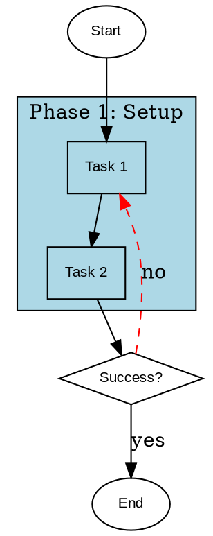
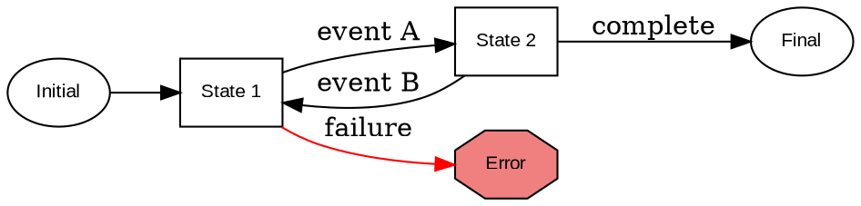
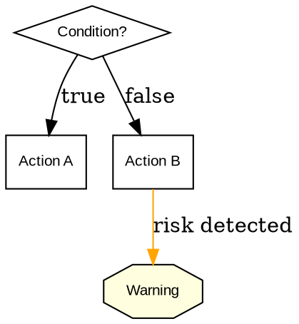

# Graphviz Documentation Integration Implementation Plan

## Metadata
- **Date**: 2025-10-13
- **Feature**: Integrate Graphviz visualizations into .claude/ documentation
- **Scope**: Replace complex Unicode box-drawing diagrams with DOT language visualizations in high-impact documentation areas
- **Estimated Phases**: 5
- **Standards File**: /home/benjamin/.config/CLAUDE.md
- **Research Reports**:
  - Blog post analysis (Graphviz for CLAUDE.md visualization)
  - .claude/ implementation analysis (7 core subsystems identified)

## Overview

This plan integrates Graphviz DOT language visualizations into the .claude/ system documentation to enhance clarity and reduce ambiguity in complex workflow, state machine, and architecture documentation. The approach is incremental, targeting high-value visualization opportunities first while establishing reusable conventions and templates.

### Problem Statement

The current .claude/ documentation uses extensive Unicode box-drawing characters across 20+ files to represent complex workflows, state machines, and data flows. While functional, these ASCII diagrams have limitations:
- Difficult to maintain as systems evolve
- Limited expressiveness for complex relationships
- Ambiguous representation of conditional flows and parallelism
- No standard semantic conventions for node types

### Proposed Solution

Introduce Graphviz DOT language visualizations with semantic node shapes and color-coded clusters:
- **Entry/Exit points**: Ellipses
- **Decision points**: Diamonds
- **Actions/Processes**: Boxes
- **Warnings/Alerts**: Octagons
- **Phase grouping**: Color-coded subgraph clusters

Target the most complex, high-value documentation areas first:
1. /orchestrate workflow (6-phase parallel/conditional execution)
2. Adaptive planning system (complexity triggers, replan loops)
3. Checkpoint system (state persistence, recovery flows)
4. Agent architecture (registry dependencies, tool access)

## Success Criteria

- [ ] Graphviz conventions documented in .claude/docs/
- [ ] DOT diagram templates created for common patterns (workflows, state machines, decision trees)
- [ ] /orchestrate workflow visualized with full phase structure
- [ ] Adaptive planning state machine diagram created
- [ ] Checkpoint lifecycle flowchart implemented
- [ ] Agent architecture dependency graph generated
- [ ] All diagrams render correctly as PNG/SVG
- [ ] Existing Unicode diagrams replaced in high-impact areas (at least 10 files)
- [ ] Documentation standards updated to reference Graphviz conventions
- [ ] Validation script created to test diagram rendering

## Technical Design

### Graphviz Integration Architecture

#### Rendering Approach

**Embedded DOT with Rendered Images**:
```markdown
## Workflow Diagram

```dot
digraph orchestrate_workflow {
  // DOT source code here
}
```


```

**Rationale**:
- Markdown files remain plain text (git-friendly)
- DOT source is visible and maintainable
- Rendered images provide immediate visual reference
- Diagrams can be regenerated as needed

#### Diagram Storage Structure

```
.claude/
├── docs/
│   ├── diagrams/               # Rendered diagram images
│   │   ├── orchestrate_workflow.png
│   │   ├── adaptive_planning_state_machine.png
│   │   ├── checkpoint_lifecycle.png
│   │   └── agent_dependency_graph.png
│   ├── graphviz-conventions.md # DOT language standards
│   └── diagram-templates.md    # Reusable templates
├── commands/
│   └── orchestrate.md          # Updated with workflow diagram
└── lib/
    ├── checkpoint-utils.sh     # Updated with lifecycle diagram
    └── adaptive-planning-logger.sh  # Updated with state machine
```

#### DOT Language Conventions

**Node Shapes** (Semantic):
- `shape=ellipse` - Entry/exit points, start/end states
- `shape=diamond` - Decision points, conditionals
- `shape=box` - Actions, processes, tasks
- `shape=octagon` - Warnings, errors, alerts
- `shape=parallelogram` - Input/output operations
- `shape=cylinder` - Data stores, checkpoints

**Color Schemes**:
- **Phase clusters**: `lightblue`, `lightgreen`, `lightyellow`, `lightcoral`, `lavender`
- **State types**:
  - Normal flow: `white` fill
  - Active/current: `lightgreen` fill
  - Error states: `lightcoral` fill
  - Warning states: `lightyellow` fill
- **Edge types**:
  - Sequential: `solid` line
  - Conditional: `dashed` line
  - Parallel: `bold` line
  - Error path: `red` color

**Standard Graph Attributes**:
```dot
digraph example {
  rankdir=TB;              // Top-to-bottom layout (or LR for left-right)
  node [fontname="Arial", fontsize=10];
  edge [fontname="Arial", fontsize=9];
  bgcolor=transparent;     // For markdown embedding

  // Graph content
}
```

### Diagram Templates

#### Template 1: Multi-Phase Workflow


#### Template 2: State Machine


#### Template 3: Decision Tree


### Validation Strategy

**Diagram Rendering Script** (`/home/benjamin/.config/.claude/scripts/render-diagrams.sh`):
```bash
#!/usr/bin/env bash
# Render all DOT diagrams to PNG/SVG

set -euo pipefail

DOCS_DIR="/home/benjamin/.config/.claude/docs"
DIAGRAMS_DIR="$DOCS_DIR/diagrams"

# Ensure diagrams directory exists
mkdir -p "$DIAGRAMS_DIR"

# Find all markdown files with DOT code blocks
find "$DOCS_DIR" -name "*.md" -type f | while read -r md_file; do
  # Extract DOT blocks and render
  # (Implementation details in Phase 1)
done

echo "All diagrams rendered successfully"
```

**Validation Checks**:
1. DOT syntax validation (`dot -Tpng -O input.dot`)
2. Image file generation verification
3. Broken link detection in markdown
4. Diagram size/complexity warnings

## Implementation Phases

### Phase 1: Foundation and Conventions

**Objective**: Establish Graphviz conventions, create templates, and set up rendering infrastructure

**Complexity**: Medium

**Tasks**:

- [ ] Create `/home/benjamin/.config/.claude/docs/graphviz-conventions.md`
  - Document DOT language semantic conventions (node shapes, colors, edges)
  - Define standard graph attributes (rankdir, fonts, colors)
  - Provide 5 complete examples (workflow, state machine, decision tree, dependency graph, data flow)
  - Include rendering instructions (dot command usage)
  - Reference CommonMark embedding patterns

- [ ] Create `/home/benjamin/.config/.claude/docs/diagram-templates.md`
  - Template 1: Multi-phase workflow (parallel/sequential/conditional)
  - Template 2: State machine with transitions
  - Template 3: Decision tree with branching logic
  - Template 4: Dependency graph (hierarchical)
  - Template 5: Data flow diagram
  - Each template includes: DOT source, rendered example, use cases

- [ ] Create `/home/benjamin/.config/.claude/docs/diagrams/` directory
  - Set up directory structure for rendered images
  - Create `.gitignore` to exclude generated PNG/SVG files (keep DOT source only)

- [ ] Create `/home/benjamin/.config/.claude/scripts/render-diagrams.sh`
  - Script to extract DOT blocks from markdown files
  - Render DOT to PNG/SVG using `dot` command
  - Validate all diagrams render without errors
  - Generate manifest of all diagrams (name, source file, size)

- [ ] Create validation test in `/home/benjamin/.config/.claude/tests/test_diagram_rendering.sh`
  - Test DOT syntax validation
  - Test image generation
  - Test broken link detection
  - Test diagram complexity warnings (>50 nodes)

**Testing**:
```bash
# Validate DOT syntax
dot -Tpng -O docs/diagrams/example.dot

# Run rendering script
./scripts/render-diagrams.sh

# Run validation tests
./tests/test_diagram_rendering.sh
```

**Expected Outcome**:
- Complete Graphviz conventions documented
- 5 reusable templates available
- Rendering infrastructure in place
- Validation suite passing

---

### Phase 2: /orchestrate Workflow Visualization

**Objective**: Create comprehensive workflow diagram for the /orchestrate command's 6-phase execution model

**Complexity**: High

**Tasks**:

- [ ] Design /orchestrate workflow diagram DOT source
  - Include all 6 phases: Analysis, Research, Planning, Implementation, Debugging, Documentation
  - Show parallel execution in Research phase (2-4 agents)
  - Show conditional execution in Debugging phase (0-3 iterations)
  - Include checkpoint save/restore decision points
  - Color-code by phase type (parallel=blue, conditional=yellow, sequential=green)
  - Add agent assignments to each phase node

- [ ] Create DOT source at `/home/benjamin/.config/.claude/docs/diagrams/orchestrate_workflow.dot`
  - Use multi-phase workflow template as base
  - Add subgraph clusters for each of 6 phases
  - Include error recovery paths (red edges)
  - Show state transitions between phases
  - Add TodoWrite integration points

- [ ] Render workflow diagram
  - Generate PNG: `orchestrate_workflow.png`
  - Generate SVG: `orchestrate_workflow.svg` (for web/scaling)
  - Validate rendering quality (readable at 1920x1080)

- [ ] Update `/home/benjamin/.config/.claude/commands/orchestrate.md`
  - Replace or augment existing workflow description (lines 120-232)
  - Embed DOT source in code block
  - Add rendered image reference
  - Update "Workflow Phases" section with diagram reference
  - Keep existing text descriptions for accessibility

- [ ] Create parallel execution timing diagram
  - Show Research phase agent parallelization
  - Illustrate time savings vs sequential execution
  - Save as `orchestrate_parallel_execution.dot`

**Testing**:
```bash
# Render orchestrate diagrams
dot -Tpng -o docs/diagrams/orchestrate_workflow.png docs/diagrams/orchestrate_workflow.dot
dot -Tsvg -o docs/diagrams/orchestrate_workflow.svg docs/diagrams/orchestrate_workflow.dot

# Validate image quality
file docs/diagrams/orchestrate_workflow.png | grep "PNG image data"

# Check markdown references
grep -q "orchestrate_workflow.png" commands/orchestrate.md
```

**Expected Outcome**:
- Complete /orchestrate workflow visualized
- 2 diagrams created (main workflow + parallel timing)
- orchestrate.md updated with embedded diagrams
- All diagrams render correctly

---

### Phase 3: Adaptive Planning State Machine

**Objective**: Visualize the adaptive planning system's complexity triggers, replan loops, and loop prevention

**Complexity**: High

**Tasks**:

- [ ] Design adaptive planning state machine diagram
  - States: Planning, Implementing, Analyzing Complexity, Replanning, Completed, Failed
  - Transitions: complexity trigger (>8.0), test failure (≥2), scope drift, replan success/failure
  - Include loop prevention mechanism (max 2 replans per phase)
  - Show checkpoint save points
  - Color-code: normal (white), triggered (yellow), replanning (orange), blocked (red)

- [ ] Create DOT source at `/home/benjamin/.config/.claude/docs/diagrams/adaptive_planning_state_machine.dot`
  - Use state machine template as base
  - Add all 6 states with shape=box
  - Add decision diamonds for trigger evaluation
  - Add loop counter tracking (visual indicator)
  - Include error escalation path

- [ ] Create complexity trigger decision tree
  - Separate diagram showing trigger evaluation logic
  - Decision nodes: score >8?, task count >10?, file refs >10?
  - Actions: expand phase, continue, log only
  - Save as `adaptive_planning_triggers.dot`

- [ ] Render adaptive planning diagrams
  - Generate `adaptive_planning_state_machine.png`
  - Generate `adaptive_planning_triggers.png`
  - Validate state transitions are clear

- [ ] Update `/home/benjamin/.config/CLAUDE.md` Adaptive Planning section (lines 211-243)
  - Embed state machine diagram in "Adaptive Planning" section
  - Add trigger decision tree to "Automatic Triggers" subsection
  - Keep existing text for searchability

- [ ] Update `/home/benjamin/.config/.claude/lib/adaptive-planning-logger.sh` comments
  - Reference state machine diagram in file header
  - Add diagram path to function documentation

**Testing**:
```bash
# Render adaptive planning diagrams
dot -Tpng -o docs/diagrams/adaptive_planning_state_machine.png docs/diagrams/adaptive_planning_state_machine.dot
dot -Tpng -o docs/diagrams/adaptive_planning_triggers.png docs/diagrams/adaptive_planning_triggers.dot

# Validate transitions
grep -c "shape=diamond" docs/diagrams/adaptive_planning_state_machine.dot  # Should be ≥3

# Check CLAUDE.md updated
grep -q "adaptive_planning_state_machine.png" CLAUDE.md
```

**Expected Outcome**:
- Adaptive planning state machine visualized
- Trigger evaluation decision tree created
- CLAUDE.md updated with diagrams
- State transitions clearly documented

---

### Phase 4: Checkpoint System and Agent Architecture

**Objective**: Visualize checkpoint lifecycle and agent registry dependency graphs

**Complexity**: Medium

**Tasks**:

- [ ] Design checkpoint lifecycle flowchart
  - Lifecycle stages: Create, Save, Validate, Migrate, Restore, Resume
  - Decision points: validation success?, migration needed?, safe to resume?
  - Error paths: corruption, version mismatch, plan modified
  - Include schema version migration flow
  - Show parallel operations checkpoint (Phase 5 integration)

- [ ] Create DOT source at `/home/benjamin/.config/.claude/docs/diagrams/checkpoint_lifecycle.dot`
  - Use multi-phase workflow template
  - Add decision diamonds for validation/migration checks
  - Color-code by operation type (create=green, restore=blue, error=red)
  - Include resume conditions (5 criteria from check_safe_resume_conditions)

- [ ] Design agent architecture dependency graph
  - Show 15 agents from agent registry
  - Hierarchical structure: specialized agents depend on general-purpose
  - Tool access levels (Read only, Read+Write, Read+Write+Bash, Full access)
  - Command usage (which commands invoke which agents)
  - Save as `agent_architecture_dependencies.dot`

- [ ] Create agent tool access hierarchy diagram
  - Matrix-style visualization: agents × tools
  - Show tool restrictions per agent
  - Highlight critical paths (agents needing full access)
  - Save as `agent_tool_access_matrix.dot`

- [ ] Render checkpoint and agent diagrams
  - Generate `checkpoint_lifecycle.png`
  - Generate `agent_architecture_dependencies.png`
  - Generate `agent_tool_access_matrix.png`

- [ ] Update `/home/benjamin/.config/.claude/lib/checkpoint-utils.sh` file header
  - Add checkpoint lifecycle diagram reference (lines 1-5)
  - Document resume conditions with diagram link

- [ ] Update `/home/benjamin/.config/.claude/docs/using-agents.md`
  - Add agent architecture dependency graph
  - Add tool access matrix diagram
  - Update "Agent Coordination Patterns" section

**Testing**:
```bash
# Render checkpoint and agent diagrams
for diagram in checkpoint_lifecycle agent_architecture_dependencies agent_tool_access_matrix; do
  dot -Tpng -o "docs/diagrams/${diagram}.png" "docs/diagrams/${diagram}.dot"
done

# Validate hierarchy depth
grep -c "subgraph cluster" docs/diagrams/agent_architecture_dependencies.dot  # Should be ≥3

# Check documentation updates
grep -q "checkpoint_lifecycle.png" lib/checkpoint-utils.sh
grep -q "agent_architecture_dependencies.png" docs/using-agents.md
```

**Expected Outcome**:
- Checkpoint lifecycle fully visualized
- Agent architecture dependencies mapped
- Tool access hierarchy clear
- Documentation updated with diagrams

---

### Phase 5: Integration and Documentation

**Objective**: Update remaining documentation, create maintenance guide, and validate complete integration

**Complexity**: Medium

**Tasks**:

- [ ] Create progressive plan structure diagram
  - Show 3-tier hierarchy: Level 0 (single file) → Level 1 (phase expansion) → Level 2 (stage expansion)
  - Include expansion triggers and collapse conditions
  - Save as `progressive_plan_structure.dot`
  - Update `/home/benjamin/.config/CLAUDE.md` Plan Structure Levels section (lines 97-124)

- [ ] Create error recovery decision tree
  - Based on error-utils.sh recovery patterns
  - Decision flow: classify error → retry? → escalate?
  - Include exponential backoff logic
  - Save as `error_recovery_tree.dot`
  - Update `/home/benjamin/.config/.claude/commands/orchestrate.md` Error Handling section

- [ ] Create parallel execution coordination diagram
  - Show wave-based execution model
  - Dependency resolution visualization
  - Checkpoint boundaries between waves
  - Save as `parallel_execution_waves.dot`
  - Update `/home/benjamin/.config/.claude/docs/orchestration-guide.md`

- [ ] Update `/home/benjamin/.config/CLAUDE.md` Documentation Policy section (lines 359-381)
  - Add Graphviz conventions reference
  - Update "Use Unicode box-drawing for diagrams" to "Use Graphviz for complex diagrams, Unicode for simple trees"
  - Add diagram maintenance guidelines

- [ ] Create `/home/benjamin/.config/.claude/docs/graphviz-maintenance-guide.md`
  - Diagram update workflow (edit DOT → render → commit DOT source only)
  - When to use Graphviz vs Unicode (complexity threshold: >5 nodes)
  - Troubleshooting common rendering issues
  - Performance considerations (diagram size limits)

- [ ] Update `/home/benjamin/.config/.claude/docs/README.md`
  - Add Graphviz conventions and templates to documentation index
  - Add graphviz-maintenance-guide.md reference
  - Update "Documentation Standards" section

- [ ] Audit all documentation files for Unicode diagram replacement opportunities
  - Scan 23 files identified in grep results
  - Prioritize: orchestrate.md, implement.md, README.md, creating-commands.md
  - Replace complex Unicode diagrams (>5 nodes) with Graphviz
  - Keep simple Unicode trees (<5 nodes) for quick reference

- [ ] Create diagram manifest
  - List all created diagrams with: name, purpose, source file, dimensions
  - Save as `/home/benjamin/.config/.claude/docs/diagrams/MANIFEST.md`
  - Include rendering instructions and maintenance notes

**Testing**:
```bash
# Render all remaining diagrams
./scripts/render-diagrams.sh

# Validate all diagrams exist
for diagram in progressive_plan_structure error_recovery_tree parallel_execution_waves; do
  test -f "docs/diagrams/${diagram}.png" || echo "Missing: ${diagram}.png"
done

# Check documentation completeness
grep -c "\.png" docs/**/*.md  # Should find ≥10 diagram references

# Validate manifest
test -f docs/diagrams/MANIFEST.md

# Run full validation suite
./tests/test_diagram_rendering.sh
```

**Expected Outcome**:
- All major workflows visualized (10+ diagrams)
- Documentation Policy updated with Graphviz standards
- Maintenance guide created
- Diagram manifest complete
- Unicode diagrams replaced in high-impact areas

---

## Testing Strategy

### Unit Testing

**Diagram Syntax Validation**:
```bash
# Test DOT syntax for all diagrams
find docs/diagrams -name "*.dot" -exec dot -Tpng -O {} \;
```

**Template Validation**:
```bash
# Ensure all templates render
for template in docs/diagram-templates.md; do
  # Extract DOT blocks and test rendering
done
```

### Integration Testing

**Documentation Link Validation**:
```bash
# Check all image references are valid
grep -r "!\[.*\](.*/diagrams/.*\.png)" docs/ commands/ | while read -r line; do
  # Extract path and verify file exists
done
```

**Rendering Pipeline**:
```bash
# Test full rendering workflow
./scripts/render-diagrams.sh
# Verify all diagrams generated
# Check for rendering errors
```

### Visual Validation

**Manual Review Checklist**:
- [ ] All diagrams render at readable size (minimum 800x600px)
- [ ] Node labels are clear and unambiguous
- [ ] Color schemes are consistent across diagrams
- [ ] Decision points use diamond shapes consistently
- [ ] Parallel execution is visually distinct from sequential
- [ ] Error paths are clearly marked in red
- [ ] Subgraph clusters have appropriate labels

**Accessibility Check**:
- [ ] Alt text provided for all images
- [ ] Text descriptions maintained alongside diagrams
- [ ] Diagrams complement, not replace, textual documentation

### Performance Testing

**Diagram Complexity**:
```bash
# Warn if diagrams are too complex (>50 nodes)
for dot in docs/diagrams/*.dot; do
  node_count=$(grep -c "^\s*[a-zA-Z0-9_]* \[" "$dot")
  if [ "$node_count" -gt 50 ]; then
    echo "Warning: $dot has $node_count nodes (consider splitting)"
  fi
done
```

**Rendering Time**:
```bash
# Ensure rendering completes in <30s for all diagrams
time ./scripts/render-diagrams.sh
```

## Documentation Requirements

### New Documentation Files

1. **graphviz-conventions.md**: Complete DOT language style guide for .claude/ system
2. **diagram-templates.md**: 5 reusable templates with examples
3. **graphviz-maintenance-guide.md**: Workflow for updating and maintaining diagrams
4. **diagrams/MANIFEST.md**: Catalog of all diagrams with metadata

### Updated Documentation Files

1. **CLAUDE.md**: Update Documentation Policy section with Graphviz standards
2. **commands/orchestrate.md**: Embed workflow diagram
3. **lib/checkpoint-utils.sh**: Reference lifecycle diagram in header
4. **lib/adaptive-planning-logger.sh**: Reference state machine diagram
5. **docs/using-agents.md**: Add architecture dependency graphs
6. **docs/orchestration-guide.md**: Add parallel execution diagram
7. **docs/README.md**: Update index with Graphviz documentation

### Standards Integration

Update project standards to specify:
- When to use Graphviz vs Unicode box-drawing (complexity threshold)
- DOT language conventions (semantic node shapes, color schemes)
- Diagram maintenance workflow (edit source, regenerate, commit)
- Validation requirements (syntax check, rendering test)

## Dependencies

### External Dependencies

- **Graphviz**: DOT language rendering engine
  - Install: `apt-get install graphviz` (Ubuntu/Debian) or `brew install graphviz` (macOS)
  - Minimum version: 2.40+
  - Required tools: `dot`, `neato` (for specific layouts)

### Internal Dependencies

- **Documentation Standards**: `/home/benjamin/.config/CLAUDE.md` (Documentation Policy section)
- **Rendering Script**: Shell script using `dot` command
- **Test Suite**: Bash test framework in `.claude/tests/`

### File Dependencies

**Modified Files**:
- `/home/benjamin/.config/CLAUDE.md` (Adaptive Planning, Documentation Policy sections)
- `/home/benjamin/.config/.claude/commands/orchestrate.md` (Workflow section)
- `/home/benjamin/.config/.claude/lib/checkpoint-utils.sh` (Header comments)
- `/home/benjamin/.config/.claude/lib/adaptive-planning-logger.sh` (Header comments)
- `/home/benjamin/.config/.claude/docs/using-agents.md` (Agent architecture section)
- `/home/benjamin/.config/.claude/docs/orchestration-guide.md` (Parallel execution)
- `/home/benjamin/.config/.claude/docs/README.md` (Documentation index)

**New Files**:
- `/home/benjamin/.config/.claude/docs/graphviz-conventions.md`
- `/home/benjamin/.config/.claude/docs/diagram-templates.md`
- `/home/benjamin/.config/.claude/docs/graphviz-maintenance-guide.md`
- `/home/benjamin/.config/.claude/docs/diagrams/` (directory)
- `/home/benjamin/.config/.claude/docs/diagrams/MANIFEST.md`
- `/home/benjamin/.config/.claude/scripts/render-diagrams.sh`
- `/home/benjamin/.config/.claude/tests/test_diagram_rendering.sh`
- 10+ DOT source files in `docs/diagrams/*.dot`

## Risk Assessment

### Technical Risks

**Risk 1: Graphviz Not Installed**
- **Impact**: Medium (diagrams won't render)
- **Likelihood**: Low (common package)
- **Mitigation**:
  - Document installation instructions clearly
  - Provide fallback to pre-rendered images
  - Add installation check to render script

**Risk 2: Diagram Complexity Too High**
- **Impact**: Medium (maintenance burden, slow rendering)
- **Likelihood**: Medium
- **Mitigation**:
  - Enforce complexity limits (max 50 nodes)
  - Split complex diagrams into multiple views
  - Use diagram templates to constrain structure

**Risk 3: Inconsistent Conventions**
- **Impact**: High (reduces clarity benefit)
- **Likelihood**: Medium
- **Mitigation**:
  - Document conventions thoroughly in Phase 1
  - Use templates consistently
  - Validate conventions in test suite

### Maintenance Risks

**Risk 4: Diagrams Become Stale**
- **Impact**: High (misleading documentation)
- **Likelihood**: Medium (documentation drift)
- **Mitigation**:
  - Document update workflow clearly
  - Add diagram validation to CI/test suite
  - Keep DOT source in git for easy updates

**Risk 5: Over-visualization**
- **Impact**: Medium (documentation bloat)
- **Likelihood**: Low
- **Mitigation**:
  - Define clear criteria for when to use diagrams (>5 nodes)
  - Keep simple Unicode for quick reference
  - Focus on high-value areas only (per implementation order)

### Adoption Risks

**Risk 6: Learning Curve for DOT Language**
- **Impact**: Low (DOT is simple)
- **Likelihood**: Medium
- **Mitigation**:
  - Provide comprehensive templates
  - Include inline examples in conventions doc
  - Create maintenance guide with common operations

## Notes

### Implementation Order Rationale

The phased approach prioritizes:
1. **Foundation first**: Establish conventions and templates before creating diagrams
2. **High-value targets**: Start with /orchestrate (most complex workflow) and adaptive planning (most ambiguous state machine)
3. **Related areas together**: Group checkpoint and agent architecture (both system-level)
4. **Integration last**: Update remaining docs and create maintenance infrastructure after learning from earlier phases

### Balance: Graphviz vs Unicode

Not all diagrams should use Graphviz. Keep Unicode box-drawing for:
- Simple linear flows (<5 nodes)
- Quick reference trees in code comments
- Terminal output formatting

Use Graphviz for:
- Complex workflows (≥5 nodes, especially with conditionals/loops)
- State machines with multiple transitions
- Dependency graphs with hierarchies
- Data flow diagrams with multiple sources/sinks

### Future Enhancements

Potential follow-on work (not in this plan):
- Interactive SVG diagrams with clickable nodes
- Automated diagram generation from code annotations
- Diagram diff visualization (show workflow changes over time)
- Integration with Neovim for in-editor diagram preview

### Maintenance Considerations

**Update Frequency**:
- Major workflows (orchestrate, adaptive planning): Update when behavior changes significantly
- System architecture (agent dependencies, checkpoint lifecycle): Update quarterly or when new components added
- Templates: Update when new patterns emerge

**Validation Cadence**:
- Run `render-diagrams.sh` before each commit touching documentation
- Include diagram validation in pre-commit hooks (future)
- Manual visual review when diagrams change

### Success Metrics

Quantitative:
- 10+ diagrams created
- 10+ files updated with diagrams
- 100% of DOT files render without errors
- Test suite coverage ≥80%

Qualitative:
- Documentation clarity improved (subjective assessment)
- Complex workflows easier to understand
- Maintenance overhead acceptable (<5 minutes per diagram update)
