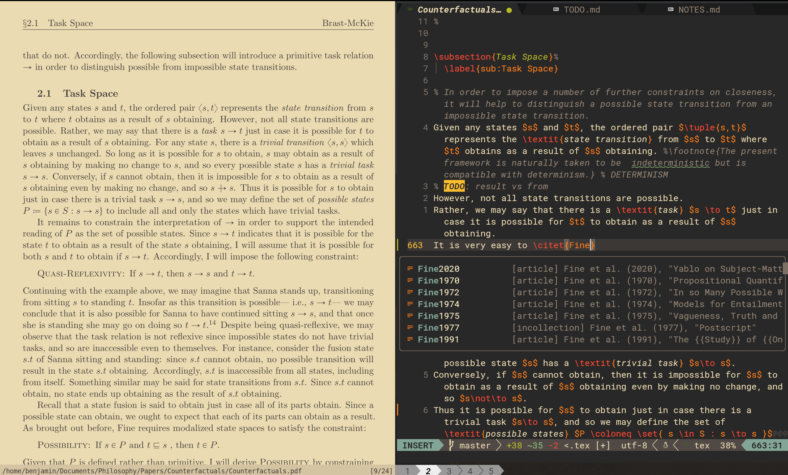

# NeoTex: A NeoVim Starter Pack for Academic Research

This setup provides a streamlined environment for academic writing, code development, and system management with powerful AI assistance.
If you already use Git to manage your `.config/` directory, these [instructions](https://github.com/benbrastmckie/.config/blob/master/docs/LearningGit.md) will allow you to filter off just the NeoVim configuration.
If your are new to using Git to manage dotfiles, this configuration is intended to provide a gentle introduction while equipping you with some of the most powerful tools for editing text, streamlining the research process.

Although the configuration focuses on using LaTeX and Markdown in NeoVim, it is compatible with any programming language, and highly extensible and customizable where the AI integration makes learning about and adapting the configuration to your specific needs much easier.
If you are interested in using NixOS, you can find my [.dotfiles](https://github.com/benbrastmckie/.dotfiles) here.
Although this configuration includes some features for managing NixOS, doing so will not be the focus.

## Features Overview



### Core Features

Although all of the following are optional, the configuration includes the following:

- **LaTeX Editing**: Comprehensive LaTeX support through VimTeX with custom templates, PDF viewing, citation management, and more
- **Markdown Writing**: Enhanced Markdown editing with smart list handling, checkboxes, and live preview
- **Reference Management**: Zotero integration for citation management, BibTeX synchronization, and academic workflow
- **Terminal Tools**: Kitty terminal emulator and Fish shell for enhanced productivity and modern CLI experience
- **AI Assistance**: Integrated AI support with Avante (code/editing) and Lectic (knowledge)
- **NixOS Management**: Convenient commands for managing NixOS configurations and packages
- **Development Tools**: LSP configuration, syntax highlighting, Git integration, and diagnostics
- **Session Management**: Save and restore editing sessions with persistent workspaces
- **File Navigation**: Telescope integration for fuzzy finding and project navigation
- **Code Operations**: LSP-powered code actions, diagnostics, and reference exploration

## Key Resources

- [NeoVim CheatSheet](https://github.com/benbrastmckie/.config/blob/master/nvim/README.md): All keybindings and features 
- [Learning Git](https://github.com/benbrastmckie/.config/blob/master/docs/LearningGit.md): Resources for Git workflow (under construction)
- [Videos](https://www.youtube.com/watch?v=_Ct2S65kpjQ&list=PLBYZ1xfnKeDRhCoaM4bTFrjCl3NKDBvqk): Demonstrations of key features (more coming soon!)

## AI Integration

This configuration includes powerful AI tools:

### Avante AI

Access AI assistance directly within Neovim with `<leader>ha` for questions or `<leader>ht` to toggle the interface.
Supports multiple providers including Claude (Anthropic), GPT (OpenAI), and Gemini (Google) where you can easily switch providers with `<leader>hd` as well as changing models with `<leader>hm`.

I have extended Avante to permit users to create/edit/switch system prompts for different tasks with `<leader>hp`.

More information can be found [here](https://github.com/yetone/avante.nvim).

### Lectic

A specialized tool for academic research and knowledge management, accessible via `<leader>ml`.
Lectic is a markdown-based frontend for Large Language Models (LLMs), designed for thoughtful, long-form conversations that can be easily archived, searched, and referenced. Unlike ephemeral chat interfaces or code-focused LLM tools, Lectic emphasizes persistence and reflection, making it particularly valuable for research, learning, and knowledge management.

More information can be found [here](https://github.com/gleachkr).

## Installation Guides

Select your operating system to follow the appropriate installation guide:

- [MacOS Installation Guide](https://github.com/benbrastmckie/.config/blob/master/docs/MacOS-Install.md)
- [Arch Linux Installation Guide](https://github.com/benbrastmckie/.config/blob/master/docs/Arch-Install.md)
- [Debian/Ubuntu Installation Guide](https://github.com/benbrastmckie/.config/blob/master/docs/Debian-Install.md)
- [Windows Installation Guide](https://github.com/benbrastmckie/.config/blob/master/docs/Windows-Install.md)

## Core Directory Structure

```
~/.config/nvim/
├── init.lua                 # Main entry point
├── lua/neotex/              # Core configuration
│   ├── bootstrap.lua        # Plugin manager setup
│   ├── core/                # Core settings
│   │   ├── autocmds.lua     # Automatic commands
│   │   ├── functions.lua    # Utility functions
│   │   ├── keymaps.lua      # Key mappings
│   │   └── options.lua      # Neovim options
│   └── plugins/             # Plugin configurations
│       ├── lsp/             # Language server settings
│       └── ai/              # AI integration settings
├── templates/               # LaTeX/document templates
├── snippets/                # LaTeX/Markdown snippets
└── after/ftplugin/          # Language-specific settings
```

## Customization

This configuration is designed to be easily customizable:

1. **Adding plugins**: Edit `lua/neotex/plugins/*.lua` files using lazy.nvim format
2. **Changing keymaps**: Modify `lua/neotex/core/keymaps.lua`
3. **Language support**: Configure in `lua/neotex/plugins/lsp/`
4. **Adding templates**: Place new templates in the `templates/` directory

For detailed customization instructions, refer to the [Neovim README](nvim/README.md).

## System Requirements

- Neovim 0.10.0 or newer
- Git 2.23 or newer
- Node.js 16 or newer
- Python 3.7 or newer

## Community & Support

- Submit issues or feature requests on [GitHub](https://github.com/benbrastmckie/.config/issues)
- Pull requests are welcome! Please see contribution guidelines
- For questions, check existing issues or open a new one

## License

This configuration is available under the [MIT License](LICENSE).
