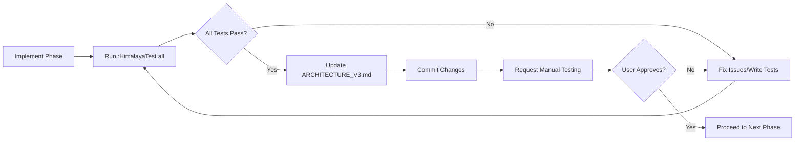

# Himalaya Plugin Architecture V3: Pragmatic Excellence

## Philosophy: Evolution, Not Revolution

This architecture combines the **pragmatic wisdom** from the current implementation with the **elegant design principles** of a clean modular structure. Rather than a complete rewrite, this represents a thoughtful evolution that preserves what works while addressing architectural debt.

## Design Principles

### 🎯 **Core Tenets**
- **Respect existing functionality** - No features lost during refactoring
- **Pragmatic compromises** - Acknowledge where ideal architecture meets real-world needs
- **Incremental improvement** - Evolution through targeted refactoring, not revolution
- **Developer productivity** - Maintain development velocity throughout transition

### 📏 **Structural Guidelines**
- **Max 6-8 files per directory** for improved navigation
- **Target 200-350 lines per file** for maintainability
- **Clear module boundaries** with well-defined interfaces
- **Minimal circular dependencies** through careful layering

## Current State Acknowledgment

### What Works Well (Preserve)
- ✅ **Unified state management** through `core/state.lua`
- ✅ **Consistent error handling** patterns across modules
- ✅ **Solid command system** in `commands/` directory
- ✅ **Working UI components** with clear separation
- ✅ **Reliable sync infrastructure** 
- ✅ **Comprehensive test coverage**

### Architectural Debt (Address)
- ⚠️ **Oversized modules**: `utils.lua` (2,046 lines), `ui/main.lua` (1,800 lines)
- ⚠️ **Mixed concerns**: Configuration contains UI dependencies
- ⚠️ **Monolithic utilities**: Single file handles 6 different domains
- ⚠️ **Directory overcrowding**: `core/` (19 files), `ui/` (14 files)

## Target Architecture

### Directory Structure

```
himalaya/
├── core/                    # Essential system services (6 files)
│   ├── api.lua             # Himalaya CLI interface (250 lines)
│   ├── state.lua           # Unified application state (300 lines) ✅ Keep as-is
│   ├── logger.lua          # Logging infrastructure (200 lines) ✅ Keep as-is  
│   ├── events.lua          # Event constants & basic utilities (150 lines)
│   ├── errors.lua          # Error handling & recovery (250 lines)
│   └── performance.lua     # Performance monitoring (200 lines)
├── config/                  # Configuration management (6 files)
│   ├── init.lua            # Configuration facade (100 lines)
│   ├── accounts.lua        # Account definitions & credentials (300 lines)
│   ├── folders.lua         # Folder mapping & structure (200 lines)
│   ├── oauth.lua           # OAuth settings & token management (250 lines)
│   ├── ui.lua              # UI preferences & keybindings (250 lines)
│   └── validation.lua      # Config validation & migration (300 lines)
├── data/                    # Data operations & persistence (7 files)  
│   ├── init.lua            # Data module exports (50 lines)
│   ├── cache.lua           # Email caching with smart invalidation (300 lines)
│   ├── drafts.lua          # Draft management & Maildir operations (350 lines)
│   ├── search.lua          # Email search & indexing (300 lines)
│   ├── templates.lua       # Email templates & expansion (350 lines)
│   ├── scheduler.lua       # Email scheduling & queues (350 lines)
│   └── maildir.lua         # Maildir format operations (250 lines)
├── utils/                   # Domain-specific utilities (6 files)
│   ├── init.lua            # Utility exports & common functions (100 lines)
│   ├── string.lua          # String formatting & manipulation (250 lines)
│   ├── email.lua           # Email formatting & validation (300 lines)
│   ├── cli.lua             # Himalaya CLI execution & parsing (350 lines)
│   ├── file.lua            # File operations & path utilities (200 lines)
│   └── async.lua           # Async operations & coordination (300 lines)
├── commands/                # User commands (6 files) ✅ Keep structure
│   ├── init.lua            # Command registration (100 lines)
│   ├── email.lua           # Email operations (350 lines)
│   ├── ui.lua              # UI commands (300 lines)
│   ├── sync.lua            # Sync commands (150 lines)
│   ├── utility.lua         # General utilities (350 lines)
│   └── orchestrator.lua    # Event orchestration (400 lines)
├── ui/                      # User interface (8 files)
│   ├── init.lua            # UI module exports (50 lines)
│   ├── coordinator.lua     # Main UI coordination (350 lines)
│   ├── session.lua         # Session & buffer management (300 lines)
│   ├── email_list.lua      # Email list display (400 lines)
│   ├── email_preview.lua   # Email reading interface (350 lines)
│   ├── email_composer.lua  # Email composition (400 lines)
│   ├── sidebar.lua         # Folder sidebar (300 lines)
│   └── notifications.lua   # UI notifications (200 lines)
├── features/                # Extended functionality (6 files) ✅ Keep as-is
├── sync/                    # Email synchronization (5 files) ✅ Keep as-is
├── setup/                   # Plugin setup (2 files) ✅ Keep as-is
└── test/                    # Testing infrastructure ✅ Keep as-is
```

## Layered Architecture with Pragmatic Dependencies

### Layer Definition

```
┌─────────────────────────────────────────────────────────────┐
│                    Setup & Commands Layer                   │
│  setup/, commands/ - Can access any layer for coordination  │
└────────────────────┬────────────────────────────────────────┘
                     │
┌────────────────────┴────────────────────────────────────────┐
│                     UI Layer                                │
│     ui/ - User interface components                         │
│     Depends on: core, config, data, utils                   │
└────────────────────┬────────────────────────────────────────┘
                     │
┌────────────────────┴────────────────────────────────────────┐
│                   Service Layers                            │
│  features/, sync/ - Extended functionality                  │
│  Depends on: core, config, data, utils                      │
└────────────────────┬────────────────────────────────────────┘
                     │
┌────────────────────┴────────────────────────────────────────┐
│                  Foundation Layers                          │
│  core/, config/, data/, utils/ - Core functionality         │
│  Minimal interdependencies within this layer                │
└─────────────────────────────────────────────────────────────┘
```

### Dependency Rules

#### Strict Rules (Must Follow)
1. **UI Layer** → Foundation + Service layers only
2. **Service Layer** (features/, sync/) → Foundation layers only  
3. **Foundation Layer** → Minimal cross-dependencies within layer

#### Pragmatic Exceptions (With Justification)
1. **config/ui.lua** → May reference UI functions for keybinding definitions
2. **commands/** → May access any layer (coordination responsibility)
3. **setup/** → May access any layer (initialization responsibility)

## Implementation Strategy

### Phase 1: Foundation Refactoring 🔥 **High Impact**

#### 1.1 Split Oversized Utils (Week 1)
**Target**: Break `utils.lua` (2,046 lines) into focused modules

**Implementation**:
```lua
-- Step 1: Create utils/ directory structure
mkdir -p utils/

-- Step 2: Extract modules
utils.lua → utils/string.lua    # String utilities (250 lines)
         → utils/email.lua     # Email formatting (300 lines)  
         → utils/cli.lua       # CLI operations (350 lines)
         → utils/file.lua      # File operations (200 lines)
         → utils/async.lua     # Async utilities (300 lines)
         → utils/init.lua      # Exports & common (100 lines)

-- Step 3: Update imports across codebase
-- Before: local utils = require('...utils')
-- After:  local utils = require('...utils') -- Still works via init.lua
--    Or:  local cli = require('...utils.cli') -- Direct access
```

**Benefits**: 
- Immediate 83% reduction in utils.lua size
- Clear separation of concerns
- Easier testing and maintenance
- Backward compatibility via utils/init.lua

#### 1.2 Configuration Restructuring (Week 2)  
**Target**: Break `core/config.lua` (1,204 lines) into specialized modules

**Implementation**:
```lua
-- Step 1: Create config/ directory
mkdir -p config/

-- Step 2: Extract configuration concerns
core/config.lua → config/accounts.lua    # Account management (300 lines)
                → config/folders.lua     # Folder mapping (200 lines)
                → config/oauth.lua       # OAuth settings (250 lines)
                → config/ui.lua          # UI & keybindings (250 lines)
                → config/validation.lua  # Validation logic (300 lines)
                → config/init.lua        # Unified interface (100 lines)

-- Step 3: Preserve existing API
-- config/init.lua provides backward compatibility:
local config = {
  accounts = require('...config.accounts'),
  -- ... other modules
}
function config.get_current_account() 
  return config.accounts.get_current()
end
return config
```

**Pragmatic Compromise**: 
- `config/ui.lua` may contain UI function references for keybindings
- This violates pure layering but provides essential functionality
- Document this as intentional architectural compromise

#### 1.3 UI Coordination Split (Week 3)
**Target**: Break `ui/main.lua` (1,800 lines) into focused components

**Implementation**:
```lua
-- Extract coordination logic
ui/main.lua → ui/coordinator.lua    # Main UI coordination (350 lines)
            → ui/session.lua        # Session & buffer mgmt (300 lines)
            
-- Keep existing modules but trim to target sizes
ui/email_list.lua     # Trim to 400 lines (currently 1,674)
ui/email_preview.lua  # Trim to 350 lines (currently 888)
```

### Phase 2: Data Layer Organization (Week 4)

#### 2.1 Create Data Directory
**Target**: Organize data operations logically

**Implementation**:
```lua
-- Move data-related modules to data/
mkdir -p data/

core/draft_manager_maildir.lua → data/drafts.lua
core/search.lua                → data/search.lua  
core/templates.lua             → data/templates.lua
core/scheduler.lua             → data/scheduler.lua
core/maildir.lua               → data/maildir.lua
# Add data/cache.lua (extracted from utils)
# Add data/init.lua (exports)
```

### Phase 3: Testing & Validation (Week 5)

#### 3.1 Comprehensive Testing
```bash
# Validate architecture compliance
./scripts/check_dependencies.sh

# Run full test suite
:HimalayaTest all

# Performance regression testing
./scripts/performance_check.sh
```

#### 3.2 Documentation Updates
- Update import statements throughout codebase
- Refresh README with new structure
- Update development documentation

## Development Patterns (Preserved from Current Architecture)

### 🗃️ **State Management Pattern**
**Status**: ✅ **Keep Exactly As-Is** - This pattern works perfectly

```lua
local state = require('neotex.plugins.tools.himalaya.core.state')

-- UI state management
state.set_current_folder('INBOX')
state.set_current_account('gmail')

-- Selection management  
state.toggle_email_selection(email_id, email_data)
state.clear_email_selections()

-- Sync state tracking
state.set('sync.status', 'running')
state.set('sync.progress', { current = 10, total = 100 })

-- Session persistence
state.save_session()
state.restore_session()
```

### ⚠️ **Error Handling Pattern**
**Status**: ✅ **Preserve Exactly** - Excellent consistent pattern

```lua
local ok, result = pcall(operation)
if not ok then
  logger.error('Operation failed', { 
    context = 'function_name',
    error = result,
    account = current_account 
  })
  notify.himalaya(
    'Operation failed: ' .. vim.fn.fnamemodify(result, ':t'),
    notify.categories.ERROR
  )
  return nil, result
end
```

### 📢 **Notification System**
**Status**: ✅ **Keep Current Categories** - Well-designed system

```lua
local notify = require('neotex.util.notifications')

-- Categorized notifications (preserve exactly)
notify.himalaya('Email sent', notify.categories.USER_ACTION)
notify.himalaya('Sync started', notify.categories.STATUS)  
notify.himalaya('Connection failed', notify.categories.ERROR)
notify.himalaya('OAuth refreshing', notify.categories.BACKGROUND)

-- Debug mode support
if notify.config.modules.himalaya.debug_mode then
  notify.himalaya('Debug: ' .. message, notify.categories.BACKGROUND)
end
```

### 🔧 **Module Initialization Pattern**
**Status**: ✅ **Standardize Across New Modules**

```lua
local M = {}

-- Module-level state  
local module_state = {
  initialized = false,
  deps = nil
}

-- Standard initialization with dependency injection
function M.init(dependencies)
  if module_state.initialized then return end
  
  -- Store dependencies for testability
  module_state.deps = dependencies or {}
  
  -- Module-specific initialization
  -- ...
  
  module_state.initialized = true
end

-- Ensure initialization before operations
function M.some_operation()
  if not module_state.initialized then
    error("Module not initialized. Call M.init() first.")
  end
  -- implementation
end

return M
```

## Import Patterns for New Architecture

### Foundation Layer Imports
```lua
-- Core services (available everywhere)
local logger = require('neotex.plugins.tools.himalaya.core.logger')
local state = require('neotex.plugins.tools.himalaya.core.state')
local events = require('neotex.plugins.tools.himalaya.core.events')

-- Configuration (available everywhere) 
local config = require('neotex.plugins.tools.himalaya.config')

-- Utilities (available everywhere)
local utils = require('neotex.plugins.tools.himalaya.utils')
local cli = require('neotex.plugins.tools.himalaya.utils.cli')

-- Data operations
local data = require('neotex.plugins.tools.himalaya.data')
local drafts = require('neotex.plugins.tools.himalaya.data.drafts')
```

### Service & UI Layer Imports
```lua
-- UI components (for other UI modules)
local ui = require('neotex.plugins.tools.himalaya.ui')
local coordinator = require('neotex.plugins.tools.himalaya.ui.coordinator')

-- Features (when needed)
local features = require('neotex.plugins.tools.himalaya.features')
local contacts = require('neotex.plugins.tools.himalaya.features.contacts')

-- Sync operations  
local sync = require('neotex.plugins.tools.himalaya.sync')
```

### Backward Compatibility
```lua
-- Old imports continue to work during transition:
local utils = require('neotex.plugins.tools.himalaya.utils')
utils.execute_himalaya(...)  -- Still works via utils/init.lua

-- New granular imports also available:
local cli = require('neotex.plugins.tools.himalaya.utils.cli')
cli.execute_himalaya(...)    -- Direct access to specific utility
```

## External Dependencies & System Requirements

### Required Binaries (Unchanged)
```bash
# Core email functionality
himalaya --version          # CLI email client
mbsync --version            # IMAP synchronization (isync package)

# System utilities
flock                       # Process locking (standard on Unix)
secret-tool                 # Linux keychain access
security                    # macOS keychain access
```

### Lua Dependencies (Preserved)
```lua
-- Neovim built-ins (no changes)
vim.api, vim.fn, vim.loop, vim.ui

-- External notifications (keep current integration)
require('neotex.util.notifications')

-- Optional async support (minimal usage)
require('plenary.nvim')  -- Only where absolutely necessary
```

### System Requirements (Document Current State)
```bash
# Maildir structure (preserve exactly)
~/Mail/[account]/
  ├── .Drafts/
  ├── .Sent/
  ├── INBOX/
  └── ...

# Configuration files (no changes to format)
~/.mbsyncrc
~/.config/himalaya/

# OAuth tokens (preserve current storage)
System keychain or ~/.config/himalaya/oauth/

# OAuth refresh scripts (keep current)
scripts/gmail_oauth_refresh.sh
scripts/outlook_oauth_refresh.sh
```

## Testing & Validation Strategy

### Architecture Compliance Testing
```bash
#!/bin/bash
# scripts/check_architecture.sh

echo "🔍 Checking architectural compliance..."

# Check for UI imports in foundation layers (should be minimal)
echo "Checking foundation layer purity..."
ui_in_foundation=$(find core/ config/ data/ utils/ -name "*.lua" -exec grep -l "require.*\.ui\." {} \; 2>/dev/null)
if [[ -n "$ui_in_foundation" ]]; then
  echo "⚠️  UI dependencies in foundation layers:"
  echo "$ui_in_foundation"
else
  echo "✅ Foundation layers are UI-independent"
fi

# Check for oversized files (>400 lines)
echo "Checking file sizes..."
oversized=$(find . -name "*.lua" -not -path "./test/*" -exec wc -l {} \; | awk '$1 > 400 {print $2 " (" $1 " lines)"}')
if [[ -n "$oversized" ]]; then
  echo "⚠️  Oversized files:"
  echo "$oversized"
else
  echo "✅ All files under 400 lines"
fi

# Check directory file counts (max 8 files)
echo "Checking directory sizes..."
for dir in core config data utils ui commands features sync setup; do
  if [[ -d "$dir" ]]; then
    count=$(find "$dir" -maxdepth 1 -name "*.lua" | wc -l)
    if (( count > 8 )); then
      echo "⚠️  $dir/ has $count files (max 8 recommended)"
    else
      echo "✅ $dir/ has $count files"
    fi
  fi
done

# Check for circular dependencies
echo "Checking for potential circular dependencies..."
# Implementation would scan require statements for cycles

echo "Architecture check complete!"
```

### Functional Testing Integration
```lua
-- Preserve all current test infrastructure
test/
├── commands/        # Command-specific tests ✅ Keep all
├── features/        # Feature tests ✅ Keep all  
├── integration/     # Workflow tests ✅ Keep all
├── performance/     # Performance tests ✅ Keep all
└── utils/          # Test utilities ✅ Keep all

-- Add architecture-specific tests
test/
├── architecture/
│   ├── test_imports.lua      # Validate import patterns
│   ├── test_file_sizes.lua   # Check size constraints
│   └── test_dependencies.lua # Check layer compliance
└── unit/           # New unit tests for refactored modules
    ├── utils/      # Tests for each utils module
    ├── config/     # Tests for each config module
    ├── data/       # Tests for each data module
    └── ui/         # Tests for refactored UI modules
```

### Test Writing Guidelines

#### Unit Test Template
```lua
-- test/unit/utils/test_string.lua
local test_framework = require('neotex.plugins.tools.himalaya.test.utils.test_framework')
local string_utils = require('neotex.plugins.tools.himalaya.utils.string')

local M = {}

function M.test_truncate_string()
  -- Test normal truncation
  test_framework.assert_equals(
    string_utils.truncate('very long string', 10),
    'very lo...',
    'Should truncate long strings'
  )
  
  -- Test short string preservation
  test_framework.assert_equals(
    string_utils.truncate('short', 10),
    'short',
    'Should preserve short strings'
  )
  
  -- Test edge cases
  test_framework.assert_equals(
    string_utils.truncate(nil, 10),
    '',
    'Should handle nil input'
  )
end

function M.test_format_date()
  -- Test date formatting
  local timestamp = os.time({year=2024, month=1, day=15})
  test_framework.assert_equals(
    string_utils.format_date(timestamp),
    'Jan 15',
    'Should format date correctly'
  )
end

return M
```

#### Integration Test Guidelines
- Test complete workflows across modules
- Verify backward compatibility
- Test error handling paths
- Validate state consistency

### Test Execution Commands
```vim
" Run all tests
:HimalayaTest all

" Run specific test category
:HimalayaTest unit
:HimalayaTest integration
:HimalayaTest performance

" Run tests for specific module
:HimalayaTest unit/utils
:HimalayaTest unit/config
```

## Migration Timeline & Testing Protocol

### 🧪 **Testing Requirements for Each Phase**

**CRITICAL**: Each phase must follow this strict testing protocol:

1. **Run Full Test Suite**: Execute `:HimalayaTest all` after each major change
2. **Achieve 100% Pass Rate**: All existing tests must pass
3. **Write New Tests**: Add tests for any new functionality or refactored modules
4. **Update Documentation**: Update ARCHITECTURE_V3.md with completion status
5. **Commit Changes**: Create atomic commits for each successful phase
6. **Manual Testing**: Request manual testing from user before next phase

### Phase 1: Utils Refactoring 🚀

#### Implementation Steps
1. Split `utils.lua` into domain modules
2. Create backward-compatible `utils/init.lua`
3. Update high-traffic import statements

#### Testing Protocol
```vim
:HimalayaTest all
```

#### New Tests Required
- `test/unit/utils/test_string.lua` - Test string utilities
- `test/unit/utils/test_email.lua` - Test email formatting
- `test/unit/utils/test_cli.lua` - Test CLI operations
- `test/unit/utils/test_file.lua` - Test file operations
- `test/unit/utils/test_async.lua` - Test async utilities

#### Completion Checklist
- [ ] All existing tests pass
- [ ] New module tests written and passing
- [ ] Backward compatibility verified
- [ ] ARCHITECTURE_V3.md updated with completion status
- [ ] Changes committed with message: "Phase 1: Utils refactoring complete"
- [ ] Manual testing requested from user

### Phase 2: Configuration Restructuring ⚙️

#### Implementation Steps  
1. Create `config/` directory structure
2. Split configuration concerns into focused modules
3. Preserve keybinding functionality (pragmatic compromise)
4. Update configuration access patterns

#### Testing Protocol
```vim
:HimalayaTest all
```

#### New Tests Required
- `test/unit/config/test_accounts.lua` - Test account configuration
- `test/unit/config/test_folders.lua` - Test folder mapping
- `test/unit/config/test_oauth.lua` - Test OAuth settings
- `test/unit/config/test_ui.lua` - Test UI configuration
- `test/unit/config/test_validation.lua` - Test config validation

#### Completion Checklist
- [ ] All existing tests pass
- [ ] Configuration functionality preserved
- [ ] Keybindings still functional
- [ ] New config tests written and passing
- [ ] ARCHITECTURE_V3.md updated with completion status
- [ ] Changes committed with message: "Phase 2: Configuration restructuring complete"
- [ ] Manual testing requested from user

### Phase 3: UI Architecture Cleanup 🎨

#### Implementation Steps
1. Split `ui/main.lua` into coordinator and session management
2. Trim oversized UI modules to target sizes
3. Preserve all UI functionality
4. Test UI workflows thoroughly

#### Testing Protocol
```vim
:HimalayaTest all
```

#### New Tests Required
- `test/unit/ui/test_coordinator.lua` - Test UI coordination
- `test/unit/ui/test_session.lua` - Test session management
- `test/integration/test_ui_workflows.lua` - Test complete UI workflows

#### Completion Checklist
- [ ] All existing UI tests pass
- [ ] UI functionality fully preserved
- [ ] New UI module tests written and passing
- [ ] All UI commands still work
- [ ] ARCHITECTURE_V3.md updated with completion status
- [ ] Changes committed with message: "Phase 3: UI architecture cleanup complete"
- [ ] Manual testing requested from user

### Phase 4: Data Layer Organization 🗄️

#### Implementation Steps
1. Create `data/` directory for data operations
2. Move data-related modules from `core/`
3. Create unified data access patterns
4. Validate data operation integrity

#### Testing Protocol
```vim
:HimalayaTest all
```

#### New Tests Required
- `test/unit/data/test_cache.lua` - Test caching operations
- `test/unit/data/test_drafts.lua` - Test draft management
- `test/unit/data/test_search.lua` - Test search functionality
- `test/unit/data/test_templates.lua` - Test template system
- `test/unit/data/test_scheduler.lua` - Test email scheduling
- `test/unit/data/test_maildir.lua` - Test Maildir operations

#### Completion Checklist
- [ ] All existing data operation tests pass
- [ ] Data functionality fully preserved
- [ ] New data module tests written and passing
- [ ] All data operations verified
- [ ] ARCHITECTURE_V3.md updated with completion status
- [ ] Changes committed with message: "Phase 4: Data layer organization complete"
- [ ] Manual testing requested from user

### Phase 5: Final Validation & Documentation 📝

#### Implementation Steps
1. Architecture compliance validation
2. Full integration testing
3. Performance regression testing  
4. Documentation updates

#### Testing Protocol
```vim
:HimalayaTest all
:HimalayaTest performance
:HimalayaTest integration
```

#### Validation Scripts
```bash
# Run architecture compliance check
./scripts/check_architecture.sh

# Run performance regression tests
./scripts/performance_check.sh

# Validate all imports
./scripts/validate_imports.sh
```

#### Completion Checklist
- [ ] All tests pass (100% success rate)
- [ ] Architecture compliance verified
- [ ] Performance metrics acceptable
- [ ] All documentation updated
- [ ] ARCHITECTURE_V3.md marked as complete
- [ ] Final commit with message: "Phase 5: Architecture V3 migration complete"
- [ ] Final manual testing requested from user

## Benefits Realized

### 👨‍💻 **Developer Experience**
- **Predictable structure**: Know exactly where to find functionality
- **Focused modules**: No overwhelming 2,000-line files
- **Clear interfaces**: Well-defined module boundaries
- **Easy testing**: Smaller, focused modules are easier to test

### 🔧 **Maintainability**
- **Single responsibility**: Each module has one clear purpose
- **Logical grouping**: Related functionality organized together
- **Manageable sizes**: All files under 400 lines
- **Clear dependencies**: Understand what depends on what

### 🚀 **Performance**  
- **Lazy loading**: Load only needed modules
- **Reduced memory**: Smaller modules loaded on demand
- **Better caching**: More granular dependency tracking
- **Faster startup**: Reduced initial load time

### 🧪 **Testability**
- **Pure functions**: Utilities accept parameters instead of globals
- **Dependency injection**: Easy to mock dependencies
- **Isolated modules**: Test components without side effects
- **Clear interfaces**: Well-defined testing boundaries

## Future Evolution Path

### Near-term Improvements (Post-refactoring)
1. **Event System Enhancement**: Further decouple layers through robust event bus
2. **Dependency Injection**: Move toward explicit dependency injection patterns
3. **Plugin Architecture**: Enable feature modules to be truly optional
4. **Performance Monitoring**: Built-in performance tracking and optimization

### Long-term Vision  
1. **Microservice Architecture**: Each feature as independent service
2. **Hot Reloading**: Reload individual modules without restart
3. **Plugin API**: Third-party plugin development support
4. **Configuration DSL**: More expressive configuration language

## Architectural Compromises (Acknowledged)

### Pragmatic Decisions
1. **Config UI Dependencies**: `config/ui.lua` references UI functions for keybindings
   - **Why**: Essential for user experience, configuration convenience
   - **Mitigation**: Clearly documented, isolated to one module

2. **Command Layer Access**: `commands/` can access any layer
   - **Why**: Commands need to coordinate across all functionality
   - **Mitigation**: Commands act as thin coordination layer, minimal logic

3. **Gradual Migration**: Preserve backward compatibility during transition
   - **Why**: Maintain stability, allow incremental testing
   - **Mitigation**: Remove compatibility shims after successful migration

### Future Improvements
1. **Event-Driven Keybindings**: Replace direct UI references with events
2. **Command Interface Standardization**: Formal command interface contracts  
3. **Dependency Graph Visualization**: Tools to understand and optimize dependencies

## Testing-Driven Migration Process

### 🔄 **Phase Workflow**



### 📊 **Test Coverage Requirements**

| Phase | Existing Tests | New Tests Required | Total Tests |
|-------|---------------|-------------------|-------------|
| Phase 1 (Utils) | 122 | ~25 | ~147 |
| Phase 2 (Config) | 147 | ~20 | ~167 |
| Phase 3 (UI) | 167 | ~15 | ~182 |
| Phase 4 (Data) | 182 | ~30 | ~212 |
| Phase 5 (Final) | 212 | ~10 | ~222 |

### 🎯 **Success Criteria Per Phase**

1. **100% existing test pass rate** - No regression allowed
2. **New module test coverage** - All new modules must have tests
3. **Backward compatibility tests** - Old imports must still work
4. **Performance benchmarks** - No degradation in performance
5. **Manual testing approval** - User validates functionality

## Summary

This architecture represents an **evolution, not revolution** approach with **rigorous testing at every step**. By enforcing comprehensive testing for each phase, we ensure:

- ✅ **Zero regression** - All tests must pass before proceeding  
- ✅ **Incremental validation** - Each phase independently tested and approved
- ✅ **Comprehensive coverage** - New tests for all refactored modules
- ✅ **User confidence** - Manual testing approval before next phase
- ✅ **Clean commits** - Each phase atomically committed when complete

The result is a **professional-grade email client** with clean architecture that has been **thoroughly tested at every step** of the migration process.

## Navigation
- [← Current Architecture](ARCHITECTURE.md)
- [← V2 Design](ARCHITECTURE_V2.md)  
- [Future Features](FUTURE_FEATURES.md)
- [Testing Strategy](TEST_CHECKLIST.md)